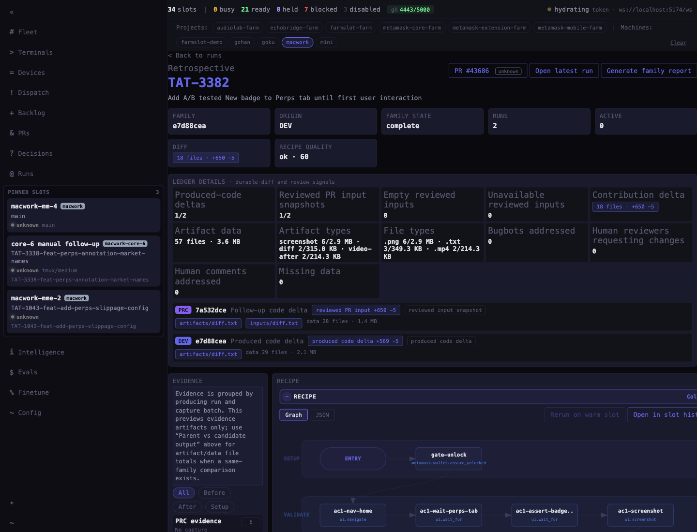
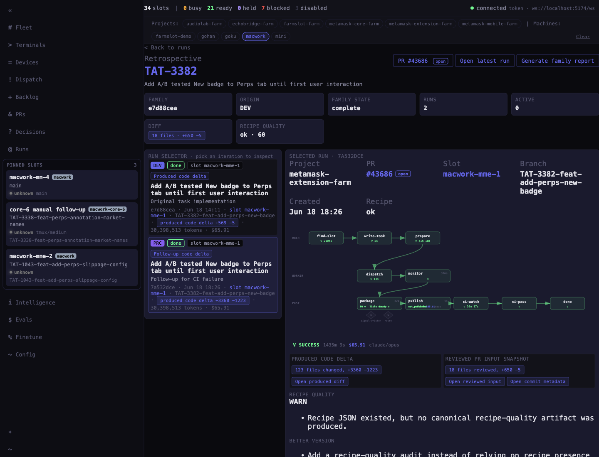
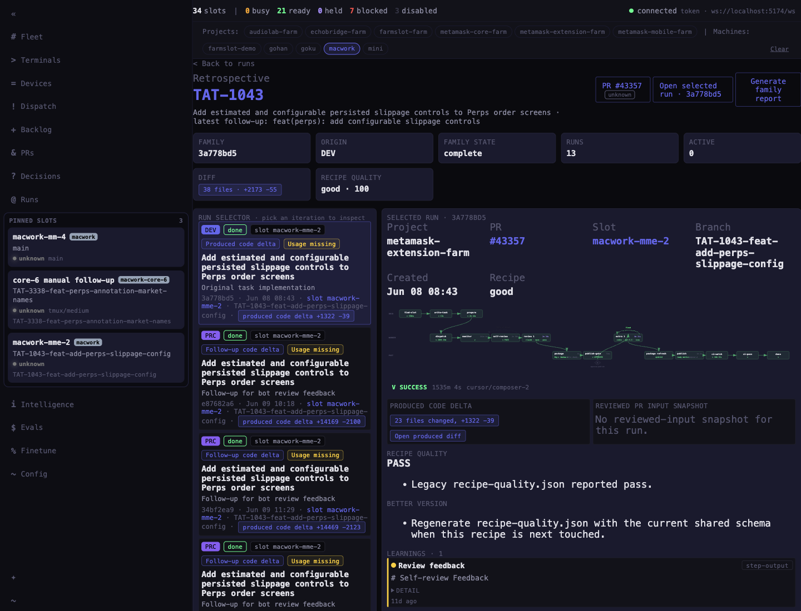

# Family retrospective run-selector evidence

Routes validated:

- `/#family/e7d88cea-5a9c-49d1-9373-ef79496f16fc?run=7a532dce-dfa8-45f9-8d9b-747ceb43f22b&machines=macwork`
- `/#family/3a778bd5-5053-42b6-a3b1-83f1095b2a7e?run=3a778bd5-5053-42b6-a3b1-83f1095b2a7e`

| Before                  | After                 |
| ----------------------- | --------------------- |
|  |  |

| Single-run / evidence-heavy family                      |
| ------------------------------------------------------- |
|  |

What changed:

- Makes the run selector the primary family control, ordered original task → follow-up iterations.
- Selecting a run shows the run itself beside the selector: project/PR/slot/branch, pipeline, produced diff, reviewed PR input, recipe quality, and evidence links.
- Keeps parent-vs-candidate/family comparison below the selected run detail.
- Collapses raw ledger rows into a secondary “Family ledger data” section so the main screen no longer duplicates the same diff/evidence facts.
- Makes evidence pair-first: before/after pairs get a compact compare strip, raw artifact groups are collapsed, and paired artifacts open the existing side-by-side `media-lightbox` compare mode by default.
