# Command Center vs Companion mobile review UX audit

Evidence captured from latest `main` after PR #38 (`c5533df`). This is a read-only audit to decide the next Companion UX slices before building more screens.

## Capture set

| Surface | Command Center | Companion |
| --- | --- | --- |
| Review/runs queue | 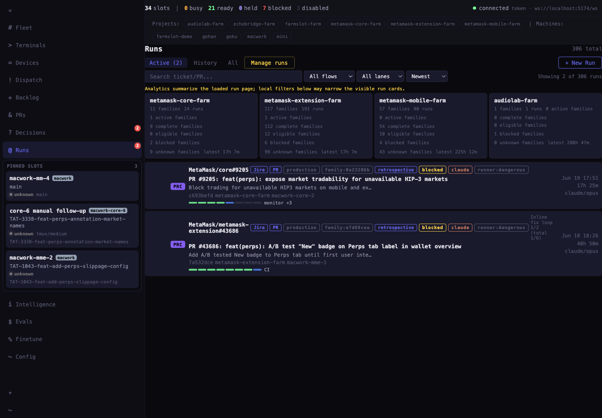 | 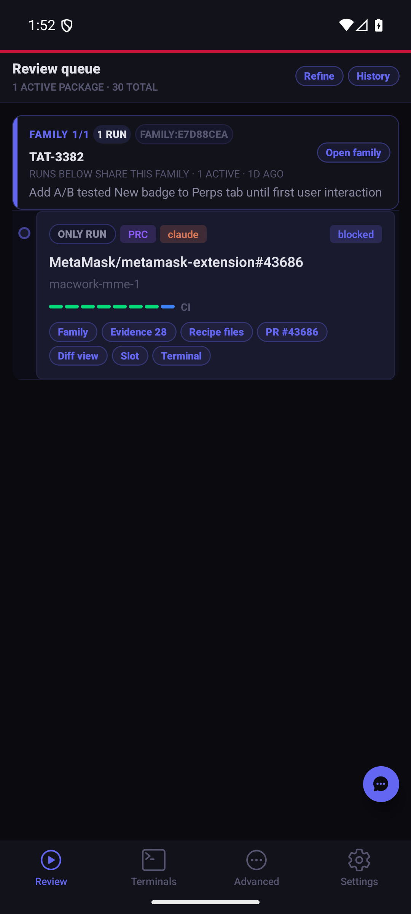 |
| Family / older runs | 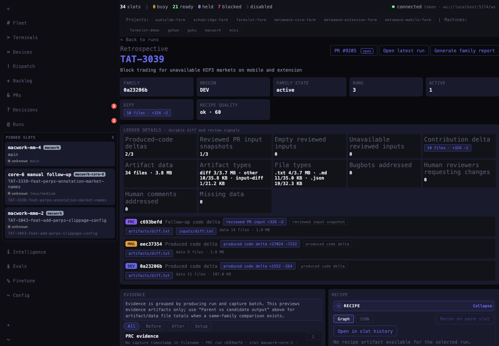 | 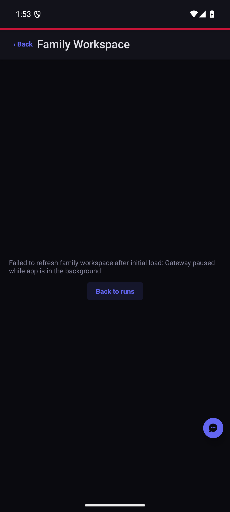 |
| Run detail | 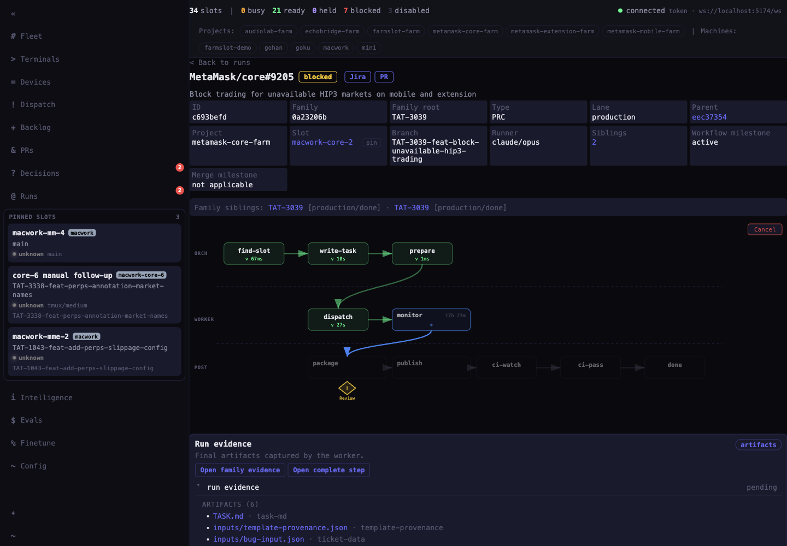 | 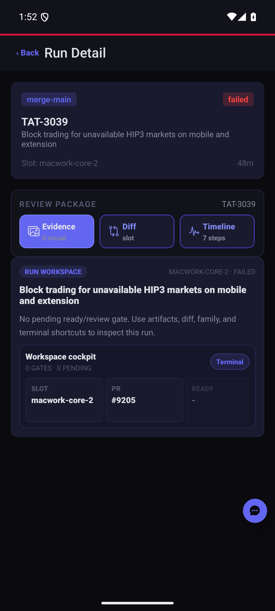 |
| Attempt compare / diff | 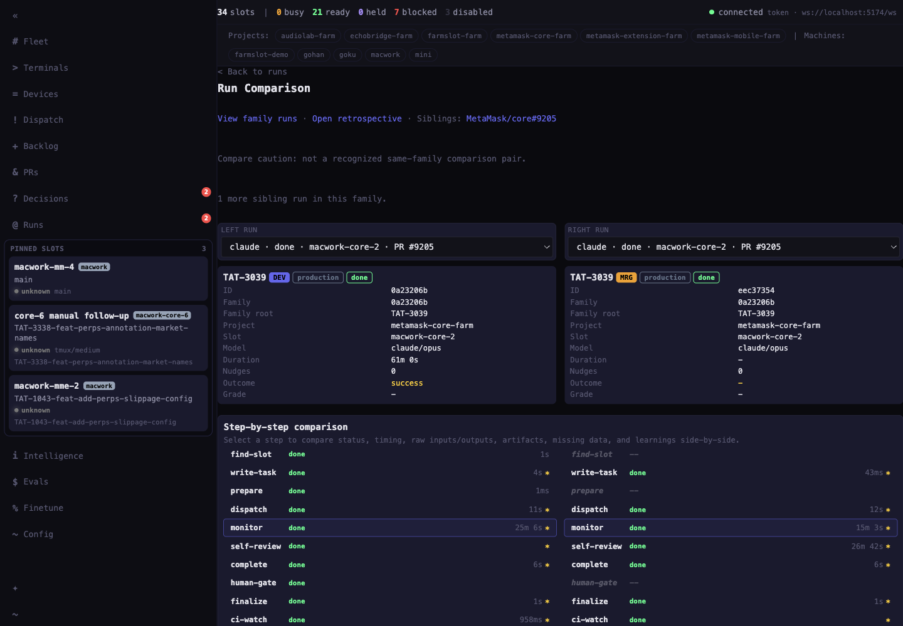 | 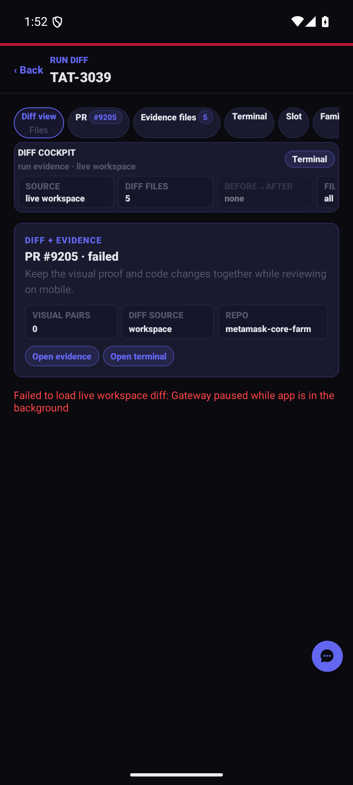 |
| Terminal steering | 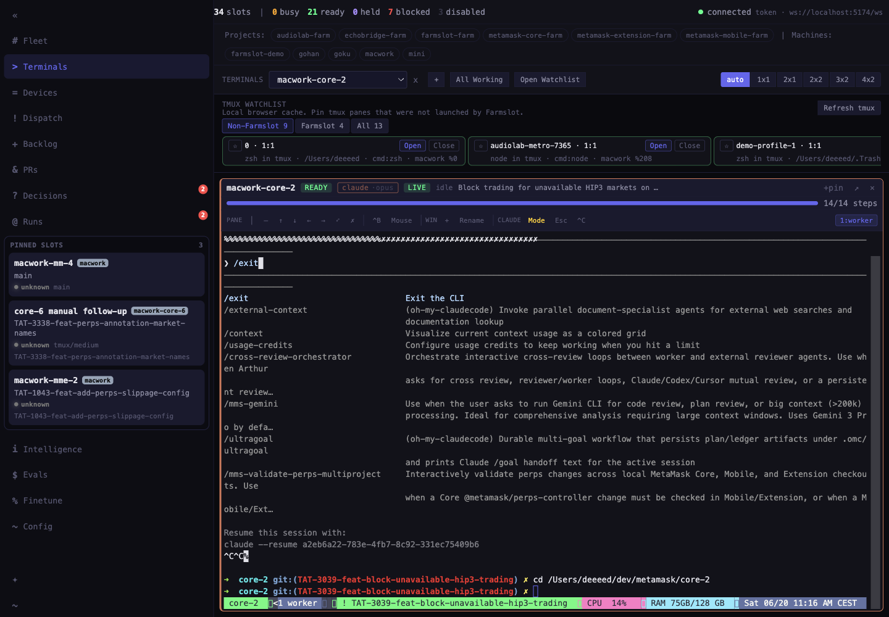 | 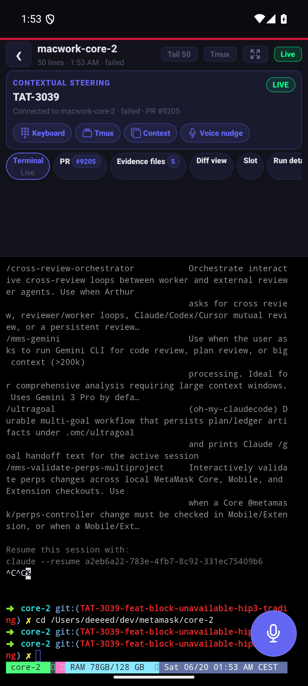 |
| PR / decisions | 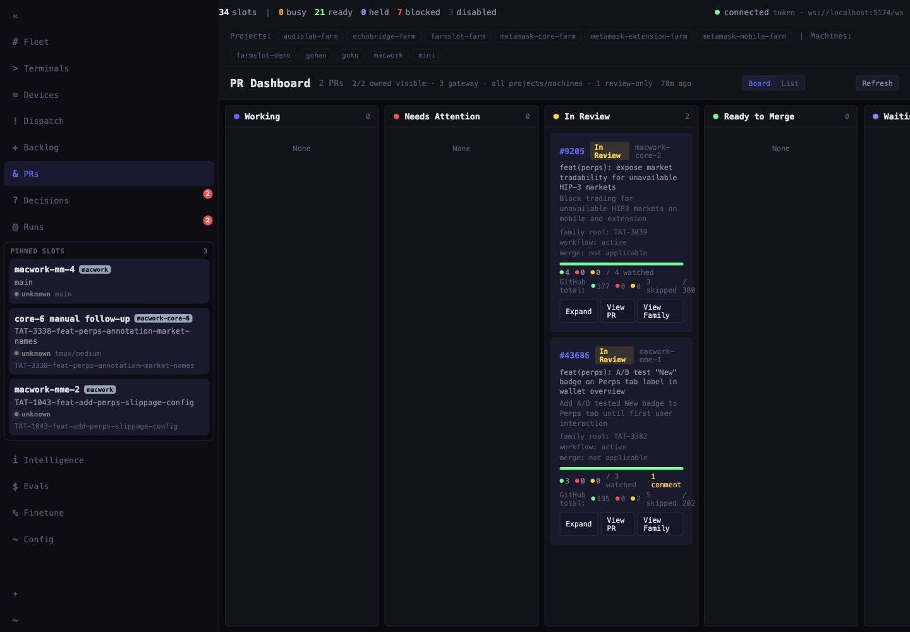 / 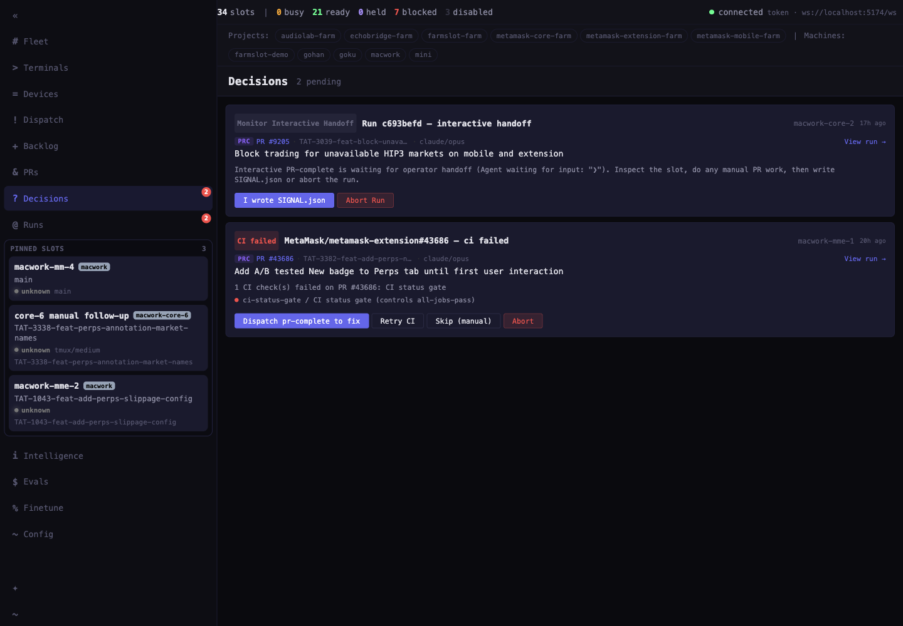 | Review queue chips only |

## Findings

| Priority | Screen | Command Center signal | Companion gap | Recommended next slice |
| --- | --- | --- | --- | --- |
| P0 | Family / older runs | Family retrospective shows 3 sibling runs, active count, diff totals, ledger details, evidence grouping, and recipe quality. | Mobile family workspace capture is not useful: it fails on gateway background pause, and the review queue only shows the active family card. Older attempts are not visible enough to answer “did the retry fix it?” | Add a mobile **Attempt History** workspace: latest run pinned, older sibling runs listed, status/diff/evidence counts, tap to open evidence/diff/terminal for any older run. |
| P0 | Attempt compare | Desktop has `Run Comparison` with left/right run selectors and step-by-step comparison. | Mobile has a single-run diff bridge, but no previous-run vs current-run compare. | Add **Compare attempts**: previous after vs current after, step deltas, diff delta, and “open previous evidence/current evidence.” |
| P1 | Evidence review | Desktop family view groups evidence by producing run and capture batch. | Mobile run evidence is now stronger, but family-level evidence does not summarize best/failed/latest evidence across sibling runs. | Add **Best evidence cards**: latest passing visual, latest failed visual, latest run with diff, latest reviewed package. |
| P1 | Run detail | Desktop run detail is dense and useful for deep debugging. | Mobile run detail still competes with evidence/diff/terminal; useful context exists but should stay behind review tabs. | Keep mobile default on **Evidence**, with compact tabs for Diff, Terminal, History, Diagnostics. |
| P1 | Terminal | Desktop terminal has full split context. | Mobile terminal steering is useful, but older-run context is not obvious when opened from history. | Carry selected run/family context into terminal header and quick nudges: “inspect previous run”, “compare latest attempt”, “open evidence.” |
| P2 | PR / decisions | Desktop PR and Decisions are full work queues. | Mobile review queue exposes PR chips, but not a compact decision/retro summary per family. | Add a compact **Gates** panel inside family/history, not a standalone heavy PR board clone. |

## Recommended implementation PR

`feat(companion): add mobile attempt history review`

Slices:

1. **Attempt History tab** in family/run review shell.
2. **Older-run evidence entrypoints**: open Evidence/Diff/Terminal for any sibling run.
3. **Attempt compare**: previous vs current visual and step/diff summary.
4. **Best evidence cards** for latest passing, latest failed, latest with diff, latest reviewed.
5. **Visual proof**: before/after mobile screenshots for history tab, older-run evidence, and attempt compare.

## Validation evidence

- Command Center screenshots captured via CDP from `http://localhost:5174`.
- Companion screenshots copied from Android UX recipe run `ux-review-flow-android-2026-06-19T23-51-58-849Z`.
