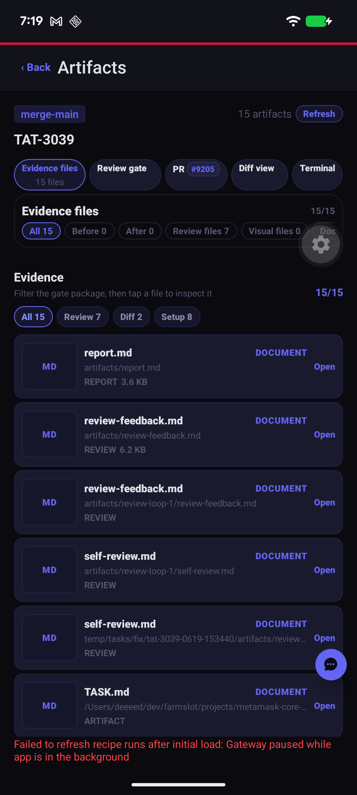
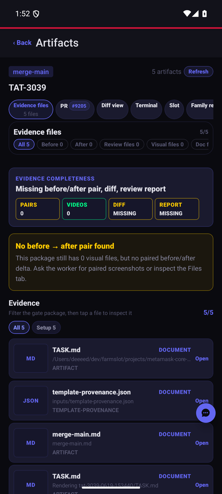
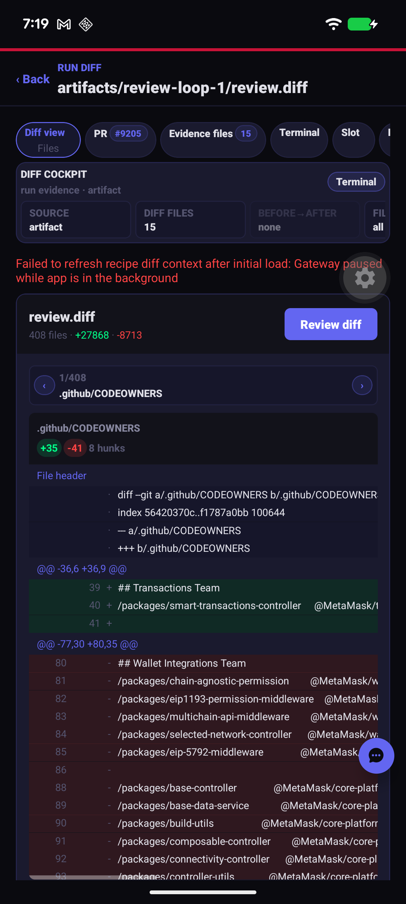
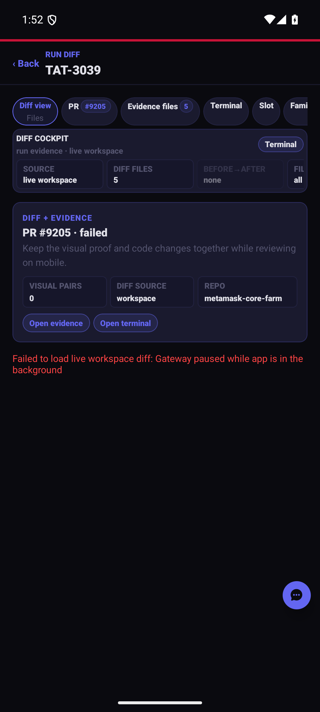
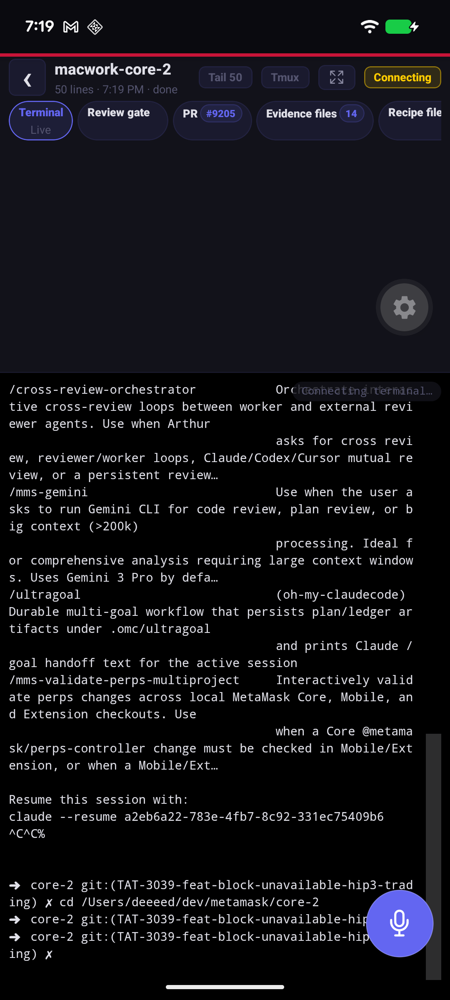
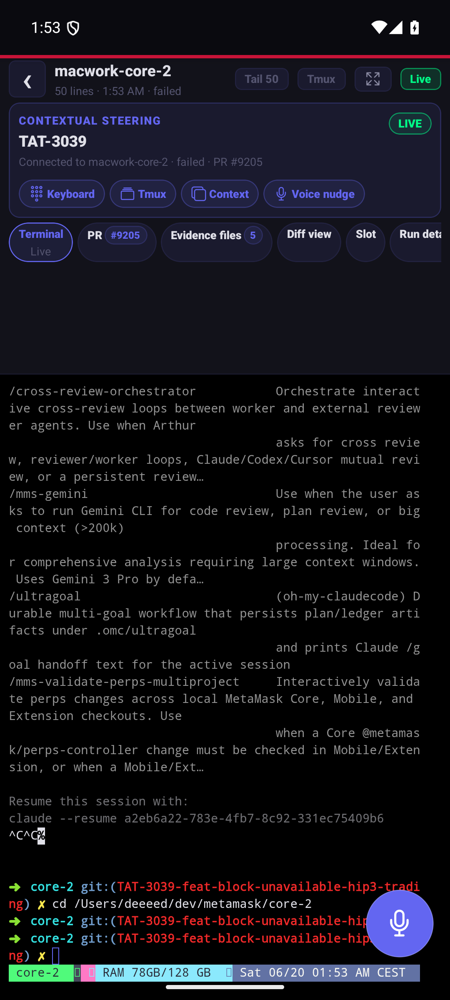
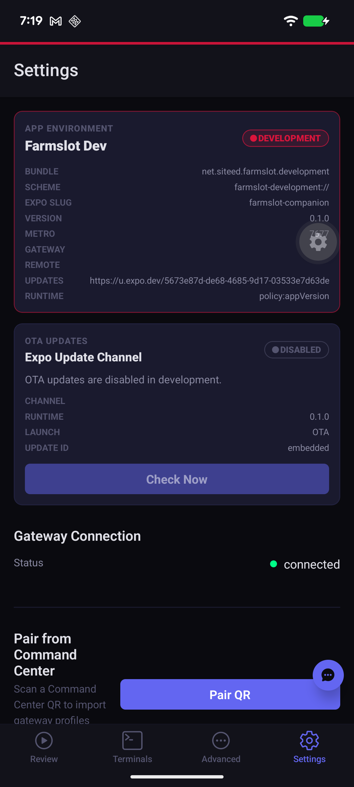
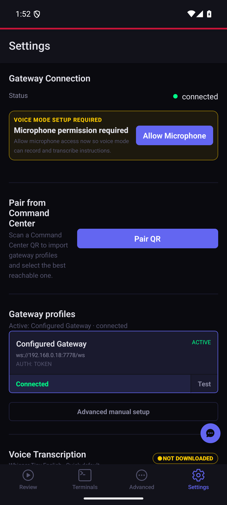

# Companion evidence-first workflows visual proof

Before/after Android screenshots for Companion UX slices 3–6.

- Before: `ux-review-flow-android-2026-06-19T17-18-43-509Z` on `origin/main` after PR #37.
- After: `ux-review-flow-android-2026-06-19T23-51-58-849Z` on this branch.
- Recipe: `ADB_SERIAL=emulator-5554 UX_RUN_ID=eec37354-ea5f-41e3-afe6-a7bbda61201d UX_SLOT_ID=macwork-core-2 UX_FAMILY_ID=0a23206b-151f-4104-bb50-ffd74db8d08d yarn recipe:run:ux-review-flow:android`
- Result: pass.

## Slice 3 — Evidence viewer upgrade

Adds an evidence workspace, completeness summary, missing-evidence guidance, and direct fullscreen/diff actions.

| Before | After |
| --- | --- |
|  |  |

## Slice 4 — Diff/evidence coupling

Adds a diff/evidence bridge with visual-pair status and fast actions back to evidence or terminal context.

| Before | After |
| --- | --- |
|  |  |

## Slice 5 — Contextual terminal steering

Adds a steering card so the terminal opens with run/slot context and common remote-control actions.

| Before | After |
| --- | --- |
|  |  |

## Slice 6 — Settings diagnostics cleanup

Keeps pairing/profile controls first and moves noisy environment/update diagnostics behind Advanced diagnostics.

| Before | After |
| --- | --- |
|  |  |
