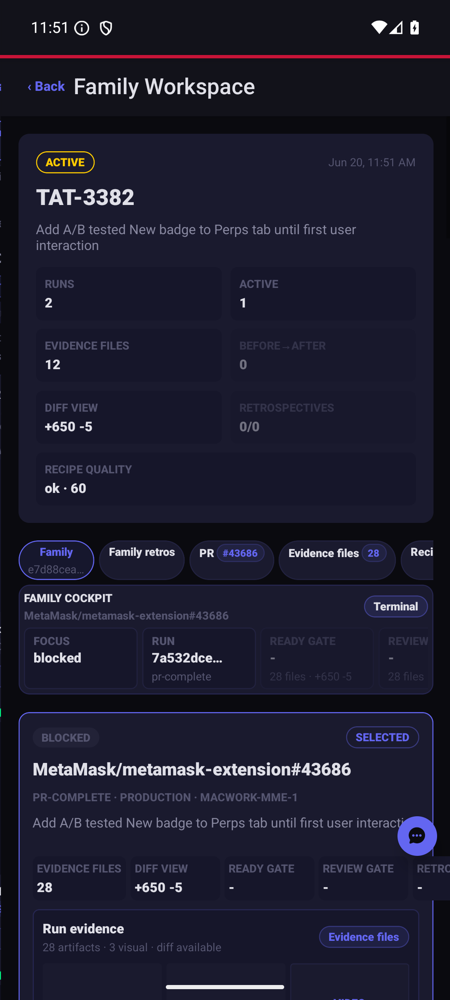
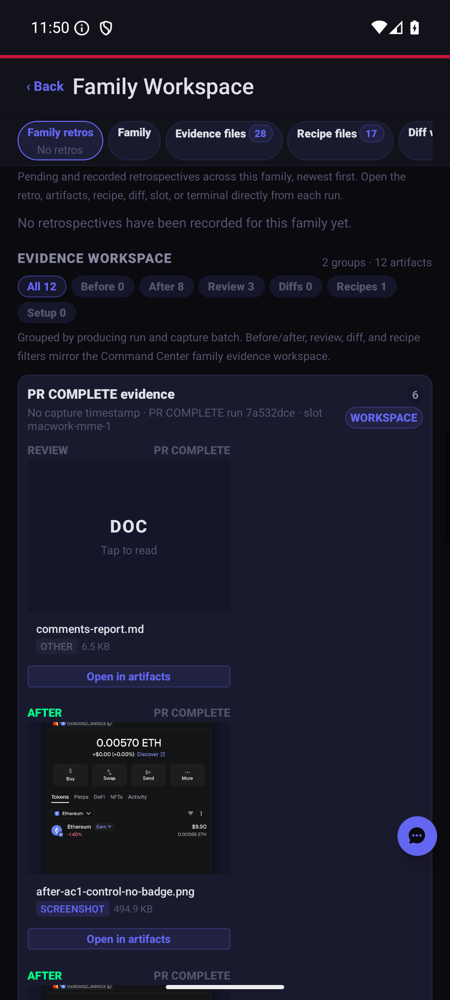

# Companion family workspace sanity evidence

Android dev-client sanity screenshots after sharing the iteration presentation model with mobile.

| Family tab                            | Family retros / evidence tab                         |
| ------------------------------------- | ---------------------------------------------------- |
|  |  |

Notes:

- The family workspace still opens the active/selected run with evidence and diff entry points.
- The family retros/evidence route remains reachable from the tab strip after the shared ledger presentation changes.
