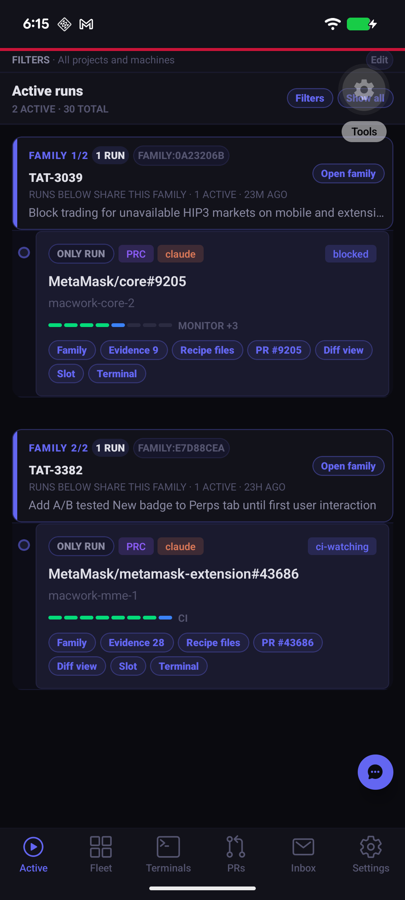
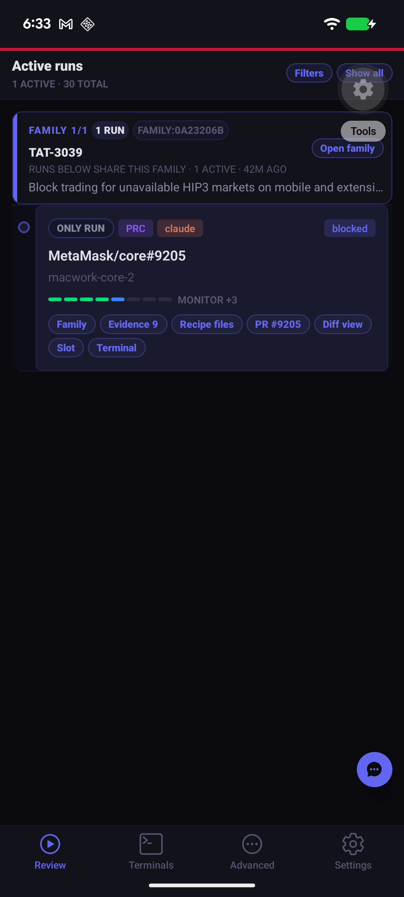
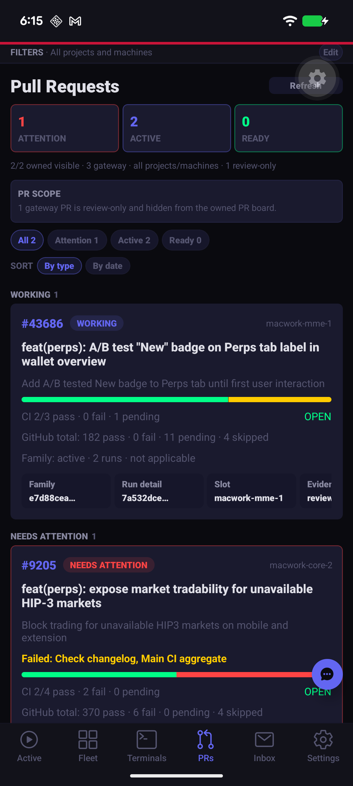
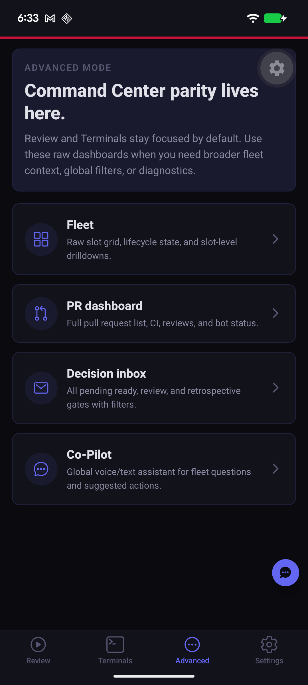
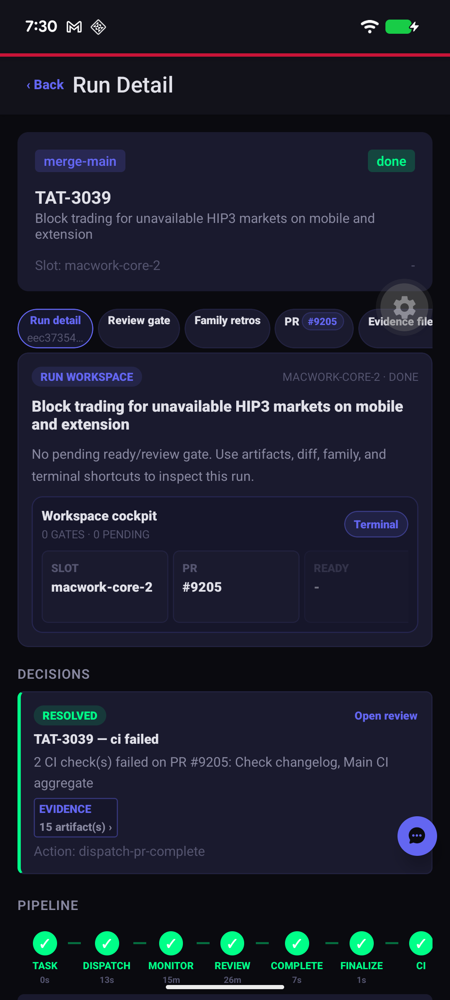
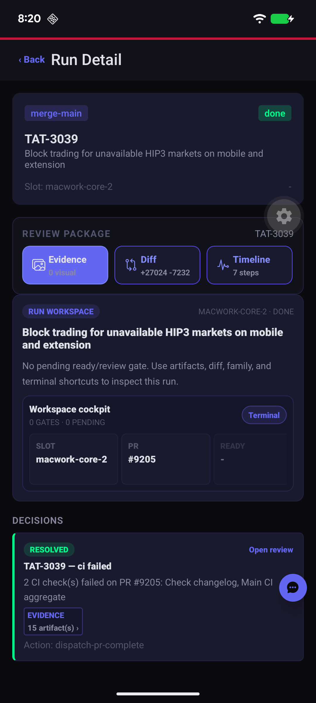
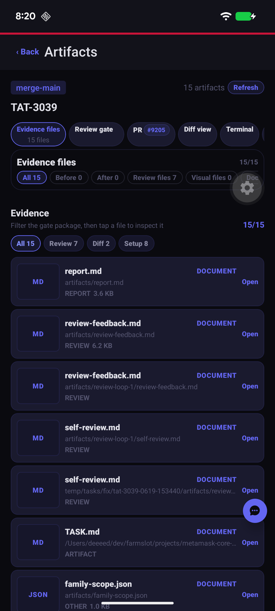
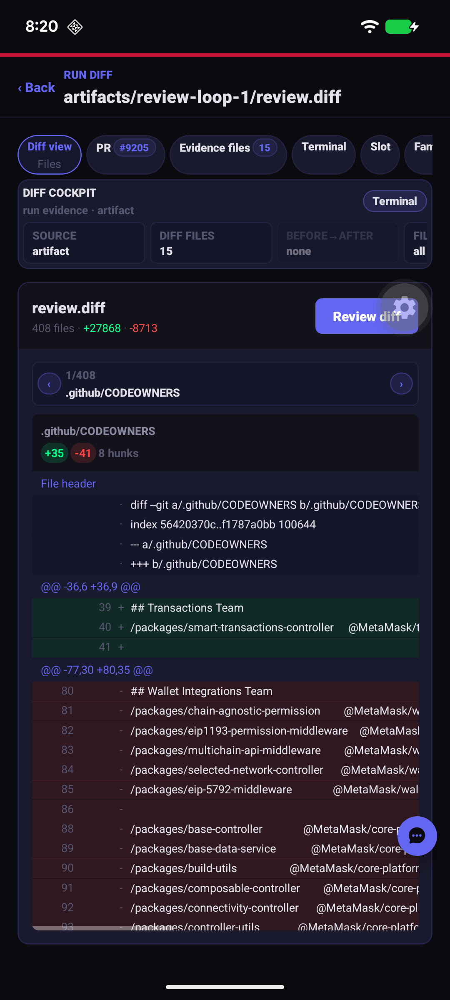

# PR 37 Companion UX visual evidence

These screenshots are checked in so the pull request has GitHub-rendered before/after proof instead of local recipe artifact paths.

## Navigation simplification

| Before | After |
| --- | --- |
|  |  |
|  |  |

## Review package shell

| Before | After |
| --- | --- |
|  |  |

Additional after-state targets:

| Evidence | Diff |
| --- | --- |
|  |  |
