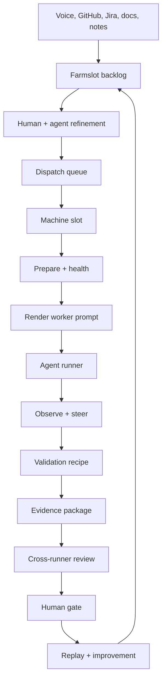
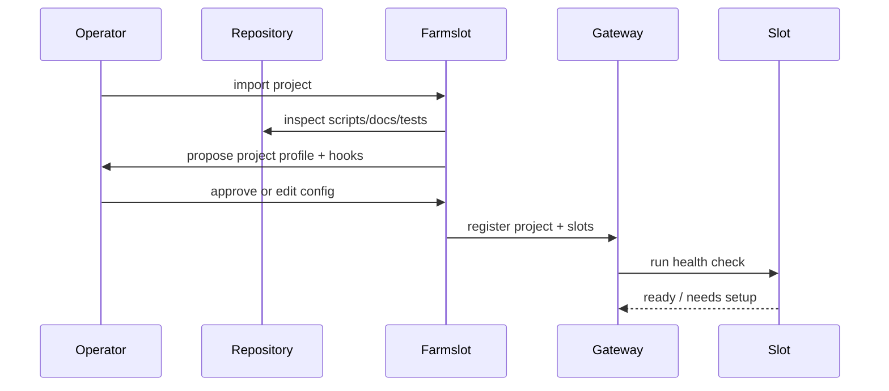
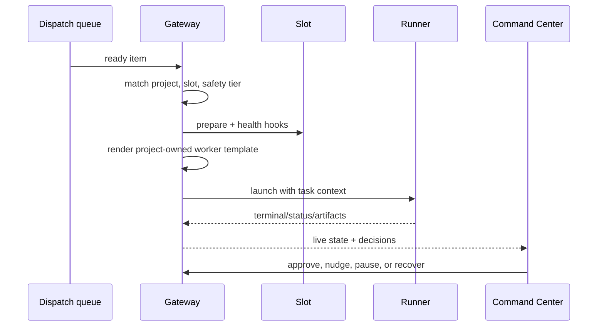
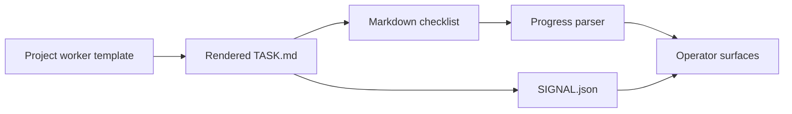
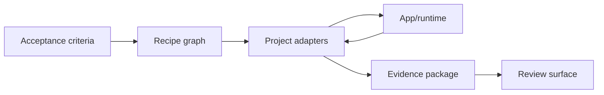
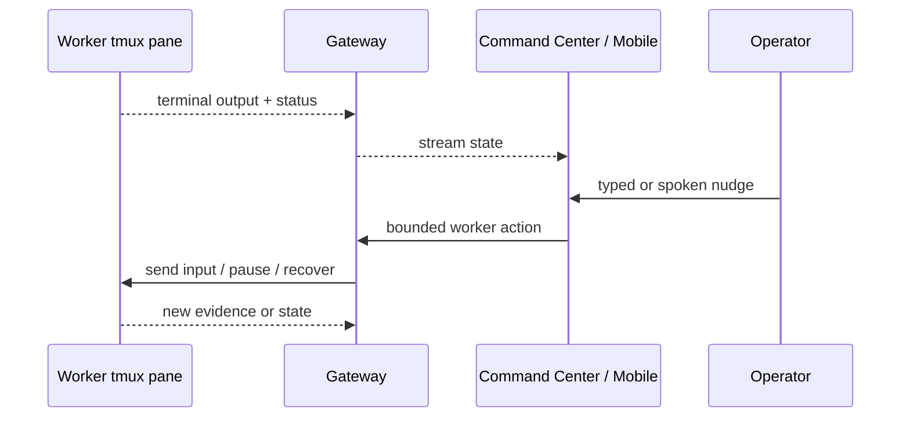

# Configurable farm flows

Farmslot scales the operator by turning repeatable engineering coordination into explicit, configurable flows.

The framework should not assume every project starts the same way, validates the same way, or uses the same runner. Instead, the farm describes the stable orchestration shape, and each project supplies the commands and adapters that make that shape real.

## Flow map

## Project import flow

Current implementations can be manual and explicit. The long-term direction is to make the inspection/proposal step prompt-assisted while keeping operator approval mandatory.

## Dispatch and execution flow

Configurable points:

- slot selection policy;
- runner/model profile;
- safety tier and human-gate policy;
- prepare and health hooks;
- project-owned prompt template and context bundle;
- completion and recovery rules.

## Prompt observability flow

The template stays project-owned, but the observable shape is shared: markdown headings, checklist items, artifacts under the task directory, and a terminal signal file. See [Customize worker prompts](../guides/customize-worker-prompts.md) for the template format and [Worker signal protocol](../reference/worker-signal-protocol.md) for `SIGNAL.json`.

## Validation and evidence flow

Configurable points:

- recipe graph and action adapters;
- project-native test commands;
- screenshots, videos, logs, traces, and diff capture;
- artifact manifest shape;
- pass/fail policy for human review.

## Steering and recovery flow

Configurable points:

- which worker controls are allowed;
- when a nudge requires confirmation;
- recovery commands;
- terminal capture depth;
- mobile vs desktop authority.

## Configuration boundary

The goal is to make projects portable into Farmslot without hiding their complexity. Project-specific behavior belongs in project-owned config and hooks. Shared orchestration belongs in the gateway, protocol, Command Center, CLI, and Mobile Companion.

That boundary lets Farmslot support very different repositories while keeping the operator experience consistent.
