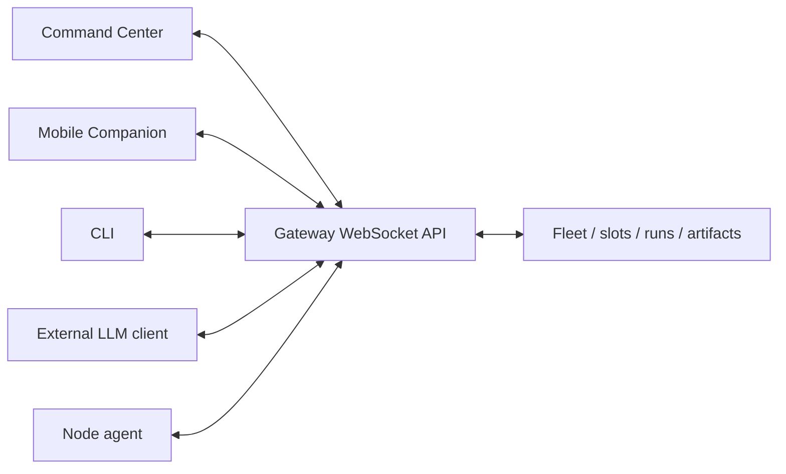
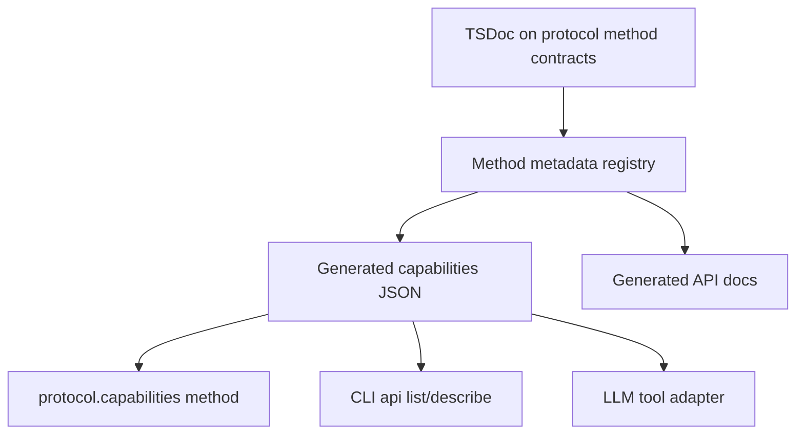

# Gateway API and protocol

Farmslot should be usable by more than the Command Center UI.

The gateway protocol is the interoperability layer that lets the desktop app, Mobile Companion, CLI tools, node agents, and even other LLM-driven clients operate the same farm through one contract.

## Current protocol shape

The WebSocket transport uses simple request, response, and event frames:

```ts
interface RequestFrame {
  type: 'req';
  id: string;
  method: string;
  params?: unknown;
}

interface ResponseFrame {
  type: 'res';
  id: string;
  ok: boolean;
  payload?: unknown;
  error?: { code: string; message: string };
}

interface EventFrame {
  type: 'event';
  event: string;
  payload?: unknown;
  seq?: number;
}
```

That means any client that can open a WebSocket and speak JSON can call the gateway.



## CLI access

The CLI already exposes a raw RPC escape hatch:

```bash
farmslot rpc fleet.status '{}'
farmslot rpc tmux.worker.list '{"includeDisconnected":true}'
farmslot rpc terminal.worker.snapshot '{"worker":{"nodeId":"local","session":"fs","target":"fs:0.0"}}'
```

This is important because it proves the gateway is not only a UI backend. It is a programmable operator API.

## Direct WebSocket access

A minimal client can call a method directly:

```js
const ws = new WebSocket('ws://localhost:7777');

ws.addEventListener('open', () => {
  ws.send(
    JSON.stringify({
      type: 'req',
      id: 'example-1',
      method: 'fleet.status',
      params: {},
    }),
  );
});

ws.addEventListener('message', (event) => {
  console.log(JSON.parse(event.data));
});
```

With auth enabled, the client first calls `auth.connect`, then sends normal requests.

## Worker status events

`tmux.worker.list` is the request/response snapshot for attachable tmux workers. Node agents also sample local tmux panes and push changed snapshots to the gateway; gateway clients receive those as `tmux.worker.inventory.updated` with the same `TmuxWorkerListResult` shape.

Do not confuse that event with `worker.signal`: `worker.signal` is task-level `SIGNAL.json` semantics for a supervised run, while tmux-worker inventory rows describe pane/runner liveness and include a `status.source` field (`hook`, `statusline`, `task-file`, or `tmux`). Runner-aware sources may also set `status.requiresAttention` so clients can highlight stopped/waiting workers without per-runner parsing.

## Why capability discovery matters

If other tools or LLMs should operate Farmslot safely, they need a machine-readable contract:

- which methods exist;
- what each method does;
- expected params and result types;
- which events may stream during the call;
- safety tier and auth requirements, using the tier definitions in the [Gateway API capability surface](/docs/reference/gateway-api#safety-tiers);
- whether the method is read-only, bounded-write, lifecycle, or high-impact;
- examples that can be copied by CLI, scripts, or LLM tool adapters.

Without this, every client has to read TypeScript source or copy UI behavior.

## Generated API surface

The protocol package is becoming the canonical source for method metadata.



## Implemented contract

`protocol.capabilities` is the gateway discovery method. It returns protocol-generated
metadata that the CLI, docs site, Command Center, Mobile Companion, or a direct LLM
client can consume:

```ts
interface GatewayCapabilitiesResult {
  protocolVersion: string;
  methods: GatewayMethodCapability[];
  events: GatewayEventCapability[];
}

interface GatewayMethodCapability {
  method: string;
  category: string;
  summary: string;
  paramsType?: string;
  resultType?: string;
  safetyTier: 'read-only' | 'bounded-write' | 'lifecycle' | 'high-impact';
  authRequired: boolean;
  emits?: string[];
  examples?: Array<{
    label: string;
    params: unknown;
  }>;
}
```

## TSDoc source style

Method params and result types should include comments that are useful to humans and machines:

```ts
/**
 * Snapshot the current terminal contents for a slot worker.
 *
 * Safety: read-only.
 * Use this before sending a nudge so the caller can verify worker state.
 */
export interface TerminalWorkerSnapshotParams {
  /** The node/session/window/pane target returned by tmux.worker.list. */
  worker: TmuxWorkerRef;
  /** Maximum number of recent lines to return. */
  lines?: number;
}
```

The curated public entry point is [Gateway API capability surface](/docs/reference/gateway-api). A raw generated method table is produced during `yarn docs:build` for implementer review, but the curated page is the public contract.

## LLM tool adapter vision

Once capabilities are discoverable, an LLM does not need custom hidden knowledge of Farmslot. It can follow the same [client pattern](/docs/reference/gateway-api#client-pattern) as the CLI or UI: discover capabilities, observe with read-only methods, and require explicit operator confirmation before higher-risk actions.

That turns Farmslot into an interoperable agentic engineering framework rather than a single UI.

## Current implementation

The protocol package owns method/event capability metadata and frame comments. The gateway exposes that metadata through `protocol.capabilities`, and the CLI consumes it through:

```bash
farmslot api list
farmslot api describe <method>
farmslot rpc <method> <params-json>
```

The public docs expose a curated capability surface while lower-level generated metadata continues to mature.

## Security boundary

Capability discovery should not grant authority by itself.

It should describe what exists. Existing auth, pairing, method safety tiers, human gates, and gateway policy still decide what a client is allowed to do.
