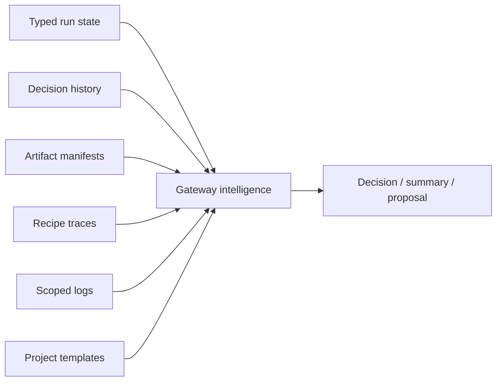

# Gateway intelligence architecture

Gateway intelligence runs over typed gateway state. It should prefer structured evidence before raw logs and always preserve operator-visible decisions.

## Inputs

## Implementation rules

1. **Evidence first** — use typed run state, manifests, traces, and decisions before broad log reading.
2. **Bounded logs** — log access should be scoped, bounded, and redacted.
3. **Deterministic fallback** — LLM-enhanced paths should have a fallback or an explicit decision state.
4. **Visible decisions** — uncertainty should create a decision queue item, not hide inside terminal output.
5. **Human-applied improvements** — Farmslot can propose changes to templates, fixtures, scripts, docs, or recipes; the operator applies them explicitly.

## Core loops

### Monitoring and nudges

The gateway watches run state, terminal progress, artifact production, and timeouts. If a worker is stuck or drifting, intelligence can propose or send a visible nudge according to policy.

### Review briefs

A review brief should combine:

- task intent;
- changed files and diff summary;
- recipe/evidence status;
- reviewer findings;
- unresolved decisions;
- recommended next action.

### Replay and eval

Previous outcomes become eval inputs:

- Did a prompt/template change improve run quality?
- Did a runner change reduce cost without weakening validation?
- Did a recipe harness change preserve previous behavior?
- Did recovery help, or hide failures?

The architecture goal is supervised improvement, not opaque automation.
