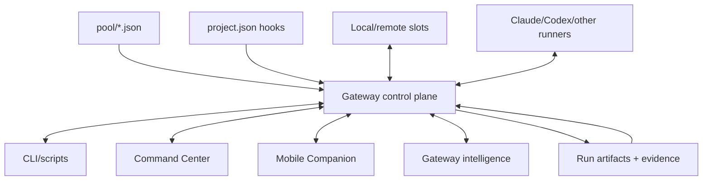

# Gateway control plane

The gateway is the persistent control plane for Farmslot.

It is the process that turns local scripts, machine state, project hooks, runner sessions, artifacts, and UI actions into one shared operating model.

## Why the gateway matters

Without a gateway, every surface has to rediscover state independently:

- shell scripts read pool files;
- terminals run agents;
- UI code polls status files;
- mobile views need their own picture;
- automation has no durable place to store decisions.

The gateway centralizes that into a typed, persistent backend.

## What the gateway owns

| Capability        | Gateway role                                                                                          |
| ----------------- | ----------------------------------------------------------------------------------------------------- |
| Fleet state       | Read pool/project config, slot status, run state, worker status, and artifacts.                       |
| Lifecycle actions | Prepare, dispatch, monitor, recycle, recover, and release through project hooks and runner contracts. |
| Streaming         | Broadcast terminal, slot, run, artifact, and decision updates to UI/mobile clients.                   |
| Run state         | Persist workflow phase, decisions, evidence, and completion state across restarts.                    |
| API boundary      | Give Command Center, Mobile Companion, CLI, and automation the same source of truth.                  |
| Project hooks     | Expand project-owned hooks without hardcoding project behavior into the framework.                    |

## Gateway-first architecture

## Design principles

### One shared truth

Desktop, mobile, CLI, and automation should observe the same run and decision model. Product surfaces may differ in depth, but they should not invent separate state machines.

### Project-owned execution

The gateway should orchestrate project hooks and contracts. It should not hardcode app-specific boot, test, fixture, or recipe semantics.

### Durable decisions

Important events should survive process restarts: pending approvals, recovery hints, run phase, artifact manifests, and publication gates.

### Operator-visible automation

Automation can reduce toil, but the gateway should expose what happened and why. Hidden automation is a reliability risk.

## Relationship to Command Center

Command Center is a client of the gateway. It visualizes and controls the system, but it should not become a second orchestration backend.

That separation keeps Farmslot usable from multiple surfaces: desktop, mobile, CLI, and future automation clients.

## Example in this repository

Farmslot dogfoods through `farmslot-farm`: pool slots point at checkouts, `project.json` owns prepare profiles and hooks, and the gateway orchestrates lifecycle without hardcoding app behavior. See [Farmslot monorepo example](../guides/farmslot-monorepo-example.md) for the unified slot model (`farmslot-{n}`, optional `ios-sim`, `sandbox-companion` for cross-surface work).
