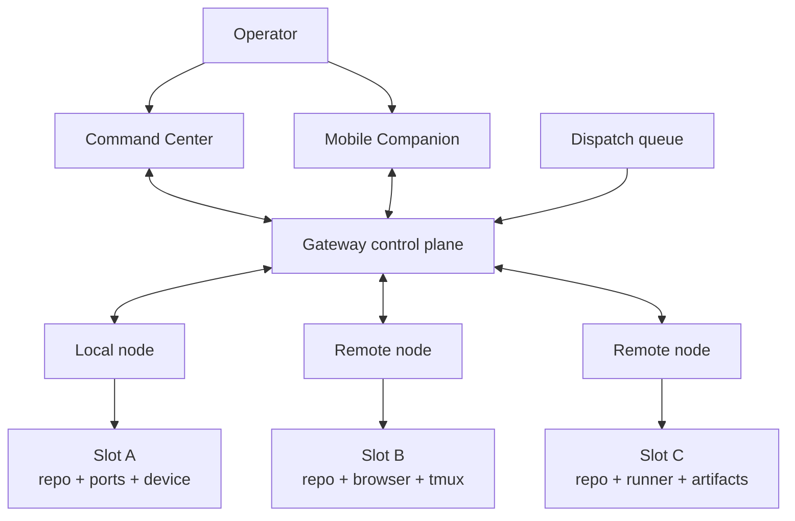
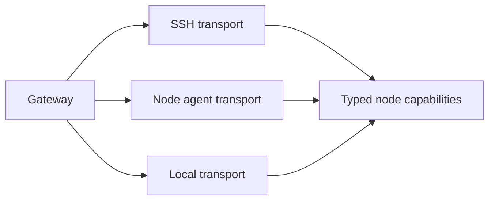

# Multi-node and security model

Farmslot is designed to run agent work across multiple machines while keeping execution observable, scoped, and operator-controlled.

A node can be a local machine, a remote macOS/Linux host, or any future machine that exposes the Farmslot node contract. Each node contributes one or more slots with explicit resources: repo path, ports, device/browser targets, tmux sessions, and runtime/artifact directories.

## Multi-node model

The gateway decides what to dispatch and where. Nodes execute only within their configured slot boundaries.

## Node communication

Farmslot supports a transport-agnostic node concept. The architecture can use:

- **SSH transport** for existing machines and fallback operations;
- **node-agent transport** for real-time presence, streaming, pairing, and RPC-style commands;
- **local transport** for slots on the same host as the gateway.

The product contract should be the same either way: the gateway invokes typed capabilities, not arbitrary UI-side shell commands.

## Security goals

Farmslot's security model is based on scoped autonomy, not blind trust.

| Goal                  | Meaning                                                                                     |
| --------------------- | ------------------------------------------------------------------------------------------- |
| Explicit nodes        | Machines must be declared, paired, or otherwise configured before use.                      |
| Explicit slots        | Work runs in known repo/runtime paths with known ports and resources.                       |
| Project-owned hooks   | Project behavior lives in `project.json` hooks instead of hidden gateway code.              |
| Capability boundaries | Control surfaces request typed actions; they should not become unrestricted remote shells.  |
| Human gates           | Publication, destructive recovery, and high-impact decisions remain operator-visible.       |
| Evidence preservation | Runs leave artifacts, terminal context, traces, and decisions for audit/review.             |
| Least surprise        | Local, remote, desktop, and mobile surfaces should show the same state and authority model. |

## Pairing and trust

For a node-agent transport, first connection should require an explicit pairing step:

1. Node starts with a gateway URL and machine identity.
2. Gateway receives a first-connect request.
3. Operator approves the node in a control surface.
4. Gateway issues or stores a token for future reconnects.
5. Node reports capabilities and slots.

This is safer than silently accepting any machine that can reach the gateway.

## Command safety tiers

Not all actions have the same risk. Farmslot should treat node capabilities by the shared [gateway safety tiers](/docs/reference/gateway-api#safety-tiers). In this architecture page, the important point is where those tiers are enforced: node capabilities stay typed and scoped, while lifecycle or high-impact transitions remain gateway-owned and policy-gated.

## Mobile security posture

Mobile Companion should use the same gateway authority model as Command Center.

Mobile can observe and steer workers, but it should not bypass gateway policy. A spoken nudge, a terminal shortcut, or an approval from mobile should become a typed gateway action with the same audit trail as the desktop surface.

## Why this matters

Multi-node execution is what lets Farmslot scale beyond one laptop. The security model is what keeps that scale usable.

The product promise is: run many agents across many machines, but keep every worker visible, every action scoped, and every important decision reviewable.
