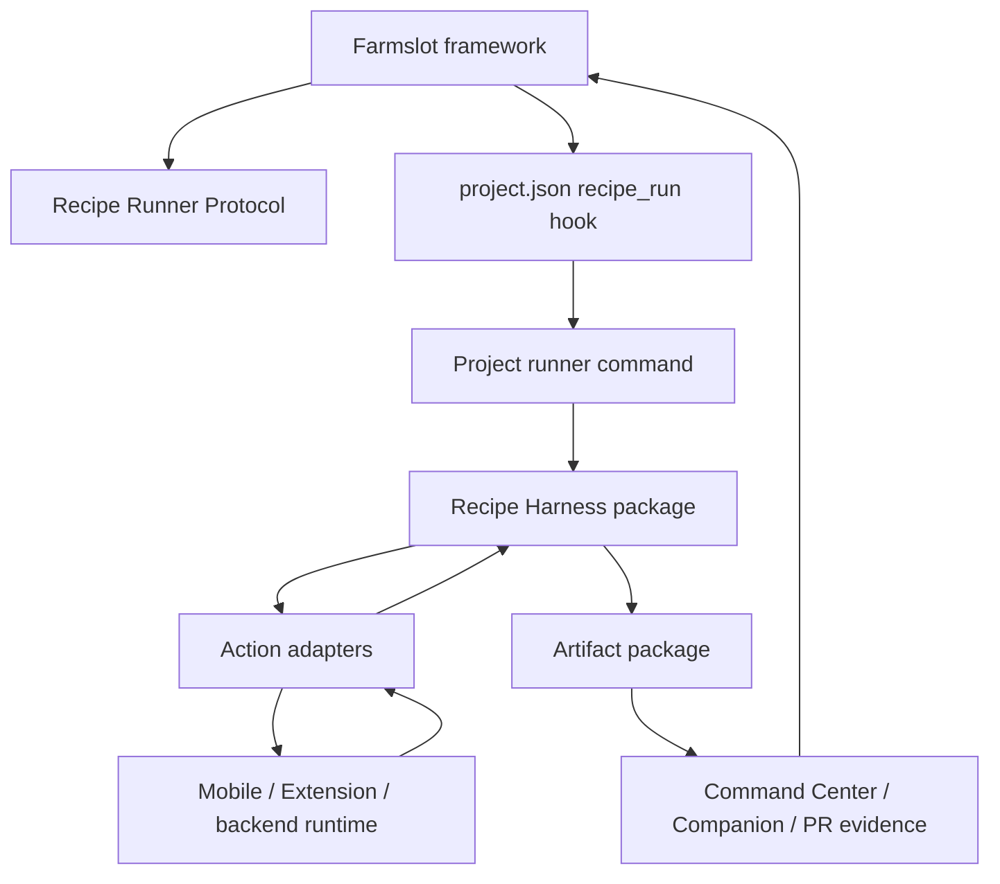

# Recipe harness architecture

Farmslot is an **agentic engineering framework and control plane** for running work across projects, machines, models, and human gates.

The recipe harness is the contract layer that lets projects plug into that framework without adopting every Farmslot feature.

## Mental model

```text
Farmslot framework
Recipe Runner Protocol
Recipe Harness runtime
Project adapters
Artifact package
Command Center / review surfaces
Agent authoring workflows
```

## Terms

| Term                       | Meaning                                                                                                                       |
| -------------------------- | ----------------------------------------------------------------------------------------------------------------------------- |
| **Farmslot framework**     | Fleet, slots, dispatch queue, worker lifecycle, eval/replay, Command Center, and evidence consumption.                        |
| **Recipe Runner Protocol** | The v1 contract for recipe graph shape, runner invocation, mandatory output files, typed artifacts, and validation.           |
| **Recipe Harness**         | Shared runtime package that validates recipe documents, executes graph nodes through adapters, and writes evidence artifacts. |
| **Project runner**         | Project-owned executable behind `project.json` hooks that calls the shared harness or wraps native test/runtime tooling.      |
| **Action adapter**         | Implementation of one recipe action such as `command`, `ui.navigate`, `cdp.evaluate`, or `project.wallet.unlock`.             |
| **Artifact package**       | Filesystem evidence API consumed by review, replay, and eval surfaces.                                                        |

## Boundary diagram



## Ownership split

| Layer                     | Owns                                                                               | Does not own                                 |
| ------------------------- | ---------------------------------------------------------------------------------- | -------------------------------------------- |
| Agent authoring workflows | Extract acceptance criteria, draft recipes, critique evidence, format review proof | Production runtime execution                 |
| Farmslot framework        | Dispatch, slots, lifecycle, evals, human gates, evidence consumption               | Project-specific UI/test semantics           |
| Recipe Runner Protocol    | Graph envelope, artifact manifest, validation contract                             | How each app clicks buttons or seeds state   |
| Recipe Harness            | Runtime execution, adapter registry, trace/summary/artifact writing                | Prompting strategy or product business logic |
| Project adapters          | Native actions for a specific app/platform                                         | Farmslot scheduling or generic review UI     |
| Artifact package          | Stable evidence API for review/eval/replay                                         | Interpretation of business semantics         |

## Package shape

The implementation should expose two reusable package layers and one adapter boundary:

```text
@farmslot/protocol        spec types + validators
@farmslot/recipe-harness  reusable runner + artifact writers + CLI
project adapters          UI/app/CDP/custom bindings
```

Simple projects can use the base harness directly with built-in actions such as `command`, assertions, log watching, and artifact indexing. Rich UI projects add only the adapters that bind their native control surfaces.

## Public reference integration

AudioLab is the public reference project for a rich app runner: [github.com/deeeed/audiolab](https://github.com/deeeed/audiolab). Its playground app keeps the app-specific CDP bridge and native audio probes in the AudioLab repo, then exposes them through a Recipe v1 action manifest and project runner. Farmslot consumes the resulting `recipe.json`, `summary.json`, `trace.json`, and `artifact-manifest.json` package without needing AudioLab-specific code in the control plane.

Farmslot also defines itself as a project (`projects/farmslot-farm/project.json`) and demo pool slot (`pool/farmslot-demo.json`). This self-integration is the minimal CLI/monorepo example: a project can start with typecheck/health hooks and grow into richer recipe evidence over time.

## Recipe Protocol v1

The current protocol source of truth is [Recipe Protocol v1](../reference/recipe-protocol-v1.md). Key additions are graph composition through `call`, reusable flow catalogs, `startState`, proof-target mapping, phase-aware recording, typed artifact manifests, and HUD/overlay support for reviewer-visible UI proof.
