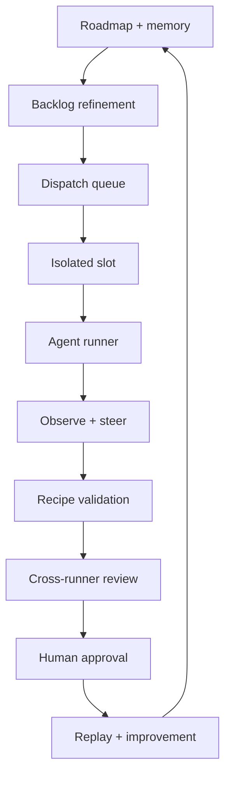

# Operating loop

Use one mental model everywhere in the docs: Farmslot is the loop from intent to approved evidence, then back into memory.

## Stages

| Stage                | Purpose                                                                                                                 |
| -------------------- | ----------------------------------------------------------------------------------------------------------------------- |
| Roadmap + memory     | Capture raw ideas, external-source signals, product intent, constraints, and previous run learnings in one place.       |
| Backlog refinement   | Work with the operator to clarify, prioritize, break down, and scope vague intent into dispatchable work.               |
| Dispatch queue       | Pick ready work when slots and runners are available.                                                                   |
| Isolated slot        | Give the agent a clean project workspace, resources, and health checks.                                                 |
| Agent runner         | Render the project-owned prompt and let Claude, Codex, Cursor, browser-automation runners, or custom runners implement. |
| Observe + steer      | Stream terminal/run state and allow typed or voice intervention.                                                        |
| Recipe validation    | Prove behavior with deterministic checks and artifacts.                                                                 |
| Cross-runner review  | Use independent reviewers to catch different classes of issues.                                                         |
| Human approval       | Keep the operator responsible for judgment and final acceptance.                                                        |
| Replay + improvement | Convert useful outcomes into better prompts, templates, recipes, and evals.                                             |

## Adoption layers

The loop can be adopted incrementally:

1. start with one review bottleneck and the proof artifact that would make it easier to approve;
2. encode that proof as a narrow recipe/evidence package;
3. add isolated slots for safer parallel work;
4. route work through the gateway and Command Center;
5. add backlog/dispatch policy, cross-runner review, and replay/eval loops.

Visual validation, executable recipes, and proof artifacts are the trust layer. The gateway is the control plane. The full loop is the product.
