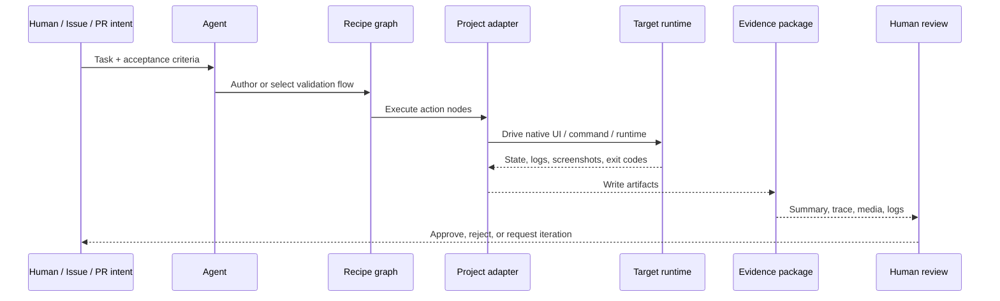

# Recipe evidence loop

The recipe loop turns agentic work from “the diff looks plausible” into “the behavior was exercised and the proof is reviewable.”

## Loop

## Why this matters

Without recipes, agents repeatedly explore the same UI and humans still need to guess whether validation was meaningful.

With recipes, validation becomes a reusable asset:

- a bug reproduction recipe can prove the fix;
- an acceptance-criteria recipe can accompany a PR;
- a regression recipe can run later against adjacent changes;
- evidence can be attached to review instead of described in prose.

## Evidence package

A compatible runner should produce a typed artifact package containing at least:

- `summary.json` — high-level run result;
- `trace.json` — ordered action trace;
- `artifact-manifest.json` — typed index of screenshots, videos, logs, and other outputs;
- resolved recipe/workflow copy when practical.
