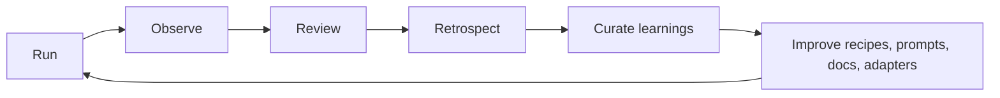

# Recursive feedback loop

Farmslot is designed around a supervised loop: every run should leave behind enough evidence for the human operator to understand what happened, and enough learning for the next run to be better.

This is not uncontrolled self-modification. A run can propose improvements, but humans still choose what becomes durable: code changes, recipe changes, prompt guidance, documentation, or project configuration.

## The loop

| Stage      | Purpose                                                    | Durable output                                                     |
| ---------- | ---------------------------------------------------------- | ------------------------------------------------------------------ |
| Run        | Execute work in an isolated slot or project runtime.       | Terminal logs, artifacts, branch state, decision history.          |
| Observe    | Capture what the agent and target app actually did.        | Screenshots, videos, traces, summaries, health checks.             |
| Review     | Compare the result against intent and acceptance criteria. | Human comments, independent model review findings, approval gates. |
| Retrospect | Explain why failures, flakes, or confusion happened.       | Retrospective notes with root cause and next-best fix.             |
| Curate     | Keep only lessons that are reusable and actionable.        | Learnings, checklist updates, recipe quality guidance.             |
| Improve    | Update the system under human control.                     | Better recipes, prompts, docs, adapters, tests, and project setup. |

## What gets fed back

Good feedback is concrete and reusable. Examples:

- A recipe failed because it asserted too early, so the domain recipe gains a better wait condition.
- A reviewer found the same missing validation twice, so the prompt checklist gets an explicit reminder.
- A run produced unclear evidence, so the recipe adds a better screenshot target or HUD intent.
- A project setup step was fragile, so the project hook or onboarding guide is fixed at the source.

Bad feedback is vague or self-serving. Avoid saving lessons like “be more careful” unless they are turned into a specific check, command, doc, or recipe pattern.

## Retrospectives and bulk processing

A single retrospective is useful after a difficult run. Bulk retro processing is useful when many small lessons accumulate faster than the operator can curate them one by one.

The bulk flow should:

1. collect pending retrospectives;
2. summarize repeated themes;
3. deduplicate overlapping lessons;
4. keep only durable, project-agnostic guidance when possible;
5. route project-specific lessons to the relevant adapter, recipe, or guide;
6. leave an auditable trail of what was accepted, rejected, or deferred.

The goal is to improve the operating system without letting raw agent output silently rewrite the operating system.

## Relationship to recipes

Recipes are one of the strongest feedback targets because they convert a lesson into repeatable validation.

When a run fails, ask:

- Can the failure become a setup precondition?
- Can the assertion be more precise?
- Should a screenshot, log capture, or trace event become mandatory evidence?
- Is the flow too specific, or should it be parameterized for reuse?
- Does the recipe intent clearly tell a human what is happening?

If the answer is yes, update the recipe or recipe guidance instead of relying on memory.

## Guardrails

The loop stays safe because Farmslot keeps humans and evidence in the path:

- **No hidden mutation:** durable changes happen through reviewed files, commits, and PRs.
- **No private leakage:** retrospectives and demo artifacts must be sanitized before becoming docs.
- **No vague learning:** a learning must map to a future check, command, recipe, prompt, or doc.
- **No bypassed validation:** behavior should be proven through the same user-facing path a reviewer cares about.
- **No single-reviewer trust:** important changes should get independent review before merge.

## Where to go next

- [Recipe evidence loop](./recipe-evidence-loop.md)
- [Recipe Protocol v1](../reference/recipe-protocol-v1.md)
- [Recipe composition quality](../reference/recipe-composition-quality.md)
- [Adoption path](../guides/adoption-path.md)
