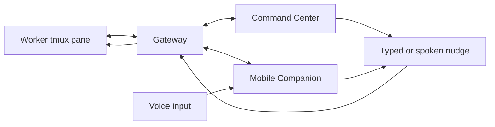
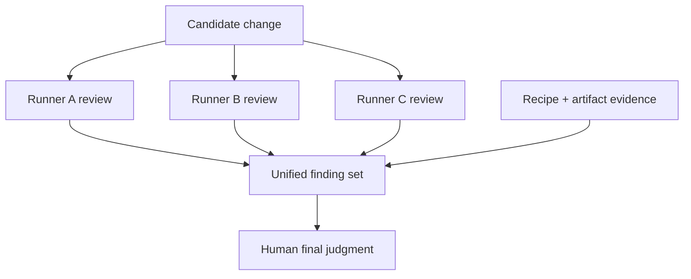

# Observability and interoperability

Farmslot's leverage comes from two ideas working together:

1. **Observability** — the operator can see what every worker is doing.
2. **Interoperability** — different runners, models, devices, and product surfaces can participate in the same supervised workflow.

This is what turns many separate agent sessions into one coherent engineering system.

## Not one black box

A Farmslot worker should never be an invisible background job that occasionally emits a diff.

The operator should be able to inspect:

- which slot is running the work;
- which runner/model/profile is being used;
- the live terminal or tmux pane;
- current workflow phase;
- task context and acceptance criteria;
- artifacts, diffs, screenshots, traces, logs, and decisions;
- whether the worker is progressing, stuck, or drifting.

## Steering from anywhere

Because worker state flows through the gateway, steering does not have to happen from the original terminal.

The operator can intervene from Command Center at the desk or from Mobile Companion away from the desk. Steering can be a typed instruction, a structured action, or a spoken nudge that the companion turns into a bounded worker message.

## Consistent review across runners

Different runners and models often have different strengths. One may be better at architecture review, another at UI edge cases, another at CI/log triage, and another at mechanical cleanup.

Farmslot should make those differences useful instead of chaotic:

- run the same review target through multiple runners;
- collect separate findings into one review workspace;
- preserve which runner found which issue;
- deduplicate or reconcile findings;
- use recipe/evidence results as the shared truth when reviewers disagree.

## Super-engineer effect

The goal is not to pretend every runner is equally good at everything. The goal is to compose their strengths while keeping the human in control.

Farmslot gives one operator:

- parallel implementation capacity;
- multiple independent review perspectives;
- shared evidence and traceability;
- live steering from desktop or mobile;
- a queue that keeps capacity filled;
- final visual and code validation before approval.

That combination creates the “super-engineer” effect: not because the human stops reviewing, but because the human can coordinate more high-quality work without losing observability or control.
