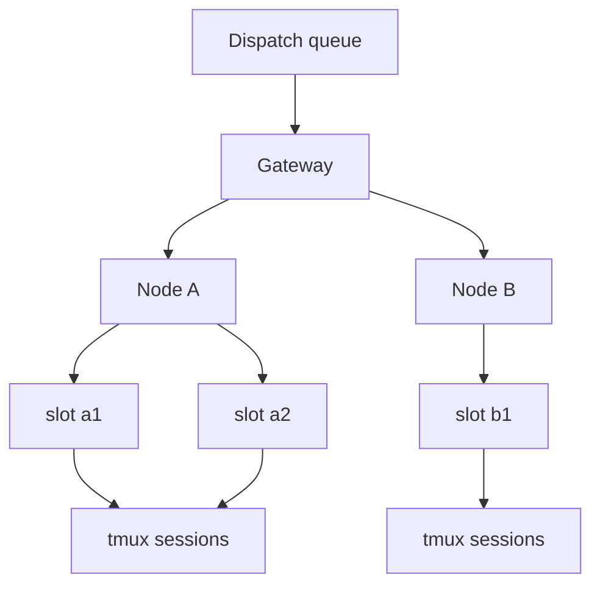

# Tmux coordination and multi-node dispatch

Farmslot uses tmux as an inspectable control surface for long-running agent work.

The key idea is simple: every worker should be attachable, observable, and steerable, even when the underlying runner differs.

## Why tmux

Tmux gives Farmslot a pragmatic execution substrate:

- visible terminal sessions;
- attach/detach without killing work;
- pane capture for monitoring and summaries;
- safe nudge/control paths;
- compatibility across local and remote machines;
- runner-neutral operation for TUI-first tools.

## Multi-node dispatch

For the complete security model, see [Multi-node and security model](../architecture/multi-node-security.md).

Farmslot can run slots across local and remote machines. The gateway coordinates dispatch, but each node owns its local resources: worktrees, ports, devices, browser targets, and tmux sessions.

## Secure dispatch principles

- Keep project behavior in `project.json` hooks rather than gateway hardcoding.
- Use explicit slot resources and ports; avoid shared mutable runtime state.
- Treat remote execution as a controlled node capability, not arbitrary shell access from the UI.
- Prefer typed gateway actions over freeform remote commands from product surfaces.
- Make worker state visible before allowing control actions.
- Preserve artifacts and terminal context for review and recovery.
- Keep publication, destructive cleanup, and risky recovery behind explicit policy or human approval.

## Coordination skill

The tmux coordination skill is the operator pattern for supervising multiple panes and models:

1. Identify active panes and their freshness.
2. Read enough output to understand state.
3. Send bounded nudges rather than large hidden instructions.
4. Avoid interrupting a worker that is actively making progress.
5. Escalate ambiguous or risky control actions to the human.

This is a major Farmslot concept because it lets a human coordinate many concurrent agents without losing the ability to inspect and intervene.
