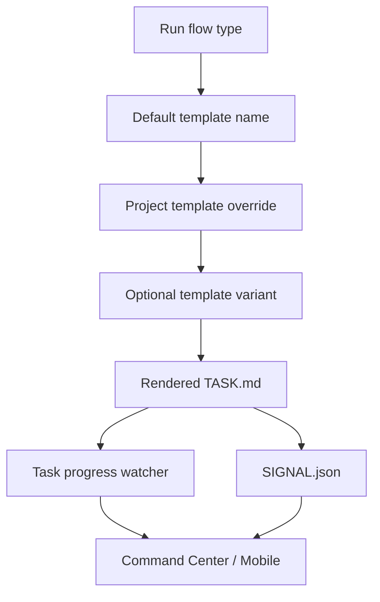

# Customize worker prompts

Project-owned worker prompts are how a farm teaches agents the exact workflow for a repository without hardcoding that workflow into Farmslot itself.

A prompt template does two jobs at once:

1. it gives the runner concrete task instructions;
2. it exposes a simple observable structure that Command Center, Mobile Companion, CLI tools, and Gateway Intelligence can monitor.

## Where templates live

Each imported project can own worker templates under its project profile:

```text
projects/<project>/templates/worker/
  fix-bug.md
  dev.md
  dev-interactive.md
  review-pr.md
  pr-complete.md
  merge-main.md
```

The default flow-to-template mapping is:

| Flow              | Default template     | Purpose                                                          |
| ----------------- | -------------------- | ---------------------------------------------------------------- |
| `fix-bug`         | `fix-bug.md`         | Reproduce, fix, validate, package evidence.                      |
| `dev`             | `dev.md`             | Implement a feature or planned change.                           |
| `dev` interactive | `dev-interactive.md` | Human-steered development session; completion is operator-owned. |
| `review-pr`       | `review-pr.md`       | Independently review an existing PR.                             |
| `pr-complete`     | `pr-complete.md`     | Continue a PR after follow-up findings, comments, CI, or review. |
| `merge-main`      | `merge-main.md`      | Resolve main-branch merge fallout.                               |

### Secondary templates (not flow-dispatch defaults)

These templates are **not** selected from the dispatch wizard flow picker. The gateway writes them into the active task directory during a run and nudges the connected worker session:

| Template             | Written as           | Signal file                   | When used                                                                                                                                                 |
| -------------------- | -------------------- | ----------------------------- | --------------------------------------------------------------------------------------------------------------------------------------------------------- |
| `ci-fix.md`          | `CI-FIX.md`          | `CI-FIX-SIGNAL.json`          | CI-watch inline fix for lint/format/type failures or actionable bot comments — avoids a full chained `pr-complete` when the worker session is still warm. |
| `self-review.md`     | (in-task artifact)   | (runner observability)        | Internal quality pass during monitor; child pass of the current run, not a new family root.                                                               |
| `self-review-fix.md` | `SELF-REVIEW-FIX.md` | `SELF-REVIEW-FIX-SIGNAL.json` | Follow-up when self-review finds fixable issues before publish/CI-watch.                                                                                  |

Resolution order for `ci-fix.md`:

1. `projects/<project>/templates/worker/ci-fix.md` — project-owned, with repo-specific validation commands (preferred).
2. `templates/worker/ci-fix.md` at the Farmslot repo root — generic default used when the project has no override.

If neither file exists, CI-watch inline fix is skipped and the operator gets a decision card (or auto-dispatch for configured categories such as test failures).

Project-specific validation belongs in the project override. The Farmslot default intentionally uses conservative `yarn lint` / `yarn lint:tsc` placeholders so new projects get a working inline-fix path before they customize.

A project can override any of these by adding a file with the same name. It can also provide variants such as `fix-bug-fast.md` or `review-pr-full.md`; the selected variant is rendered for that run without mutating the source template.

## Observable prompt shape

The prompt format is intentionally simple markdown:

````md
# Worker: Fix Bug — {{TICKET_ID}}

> **Signal file:** Write `{{TASK_DIR}}/SIGNAL.json` with status updates.

## Task

```text
TICKET: {{TICKET_ID}}
TITLE: {{TICKET_TITLE}}
BRANCH: {{BRANCH}}
TASK_DIR: {{TASK_DIR}}
STATUS: pending
```

## Checklist

- [ ] **1. Read project docs** — learn the repo-specific rules.
- [ ] **2. Update status** — set `STATUS: working` in this file.
- [ ] **3. Reproduce or understand the issue** — gather evidence.
- [ ] **4. Implement the smallest safe change** — keep scope narrow.
- [ ] **5. Validate** — run the project-owned checks.
- [ ] **6. Write report** — save artifacts under `{{TASK_DIR}}/artifacts/`.
- [ ] **7. Write completion signal** — write `{{TASK_DIR}}/SIGNAL.json`.
````

Farmslot does not need a custom parser for every project. The gateway can derive progress from ordinary markdown checkboxes and headings:

- `##` sections become phases;
- `- [ ]` and `- [x]` checklist items become steps;
- the first unchecked step is treated as the current step;
- code blocks and known non-progress sections are ignored;
- `SIGNAL.json` is the terminal completion/block/failure channel.

## Signal file

Workers write a signal file beside the rendered task. This gives the gateway a runner-neutral completion path even when terminal text is noisy.
See the canonical [Worker signal protocol](../reference/worker-signal-protocol.md) for the full schema, freshness rules, compatibility policy, and optional checklist timing extension.
Rendered tasks also include a `mark` helper, so templates can tell workers: after completing checklist item `N`, run `{{TASK_DIR}}/mark N` using the visible 1-based step number; if unsure, run `{{TASK_DIR}}/mark --help`; for the final item, add `--status complete --outcome success`.

```json
{
  "status": "complete",
  "outcome": "success",
  "disposition": "fixed",
  "step": "write-report",
  "reason": "Validation passed and evidence package was written.",
  "evidence": {
    "reportPath": "{{TASK_DIR}}/artifacts/report.md",
    "artifacts": ["{{TASK_DIR}}/artifacts/evidence-manifest.json"],
    "confidence": "high"
  },
  "timestamp": "<UTC ISO8601>"
}
```

Useful `status` values are:

| Status              | Meaning                                                                                    |
| ------------------- | ------------------------------------------------------------------------------------------ |
| `running`           | Worker is alive and reporting a current step.                                              |
| `blocked`           | Worker cannot continue without a precondition, credential, environment, or human decision. |
| `complete` / `done` | Worker finished the requested flow.                                                        |
| `failed`            | Worker reached a terminal failure.                                                         |

The signal file should be used for terminal state and compact task metadata. Ongoing progress should remain visible in the markdown checklist so the operator can inspect the task file and understand what happened. High-volume command/tool telemetry belongs in runner observability streams, not in `SIGNAL.json`.

## Template variables

Templates use `{{VAR}}` placeholders expanded when the task is written. Common variables include:

| Variable                       | Meaning                                                                |
| ------------------------------ | ---------------------------------------------------------------------- |
| `{{TICKET_ID}}`                | Backlog item, issue, PR, or task identifier.                           |
| `{{TICKET_TITLE}}`             | Human-readable title.                                                  |
| `{{BRANCH}}` / `{{PR_BRANCH}}` | Branch the worker should use.                                          |
| `{{PR_NUMBER}}`                | PR number for PR-bound flows.                                          |
| `{{TASK_DIR}}`                 | Directory where the rendered task, signal, inputs, and artifacts live. |
| `{{ARTIFACT_DIR}}`             | Project artifact directory when provided by the project config.        |
| `{{RUNTIME_DIR}}`              | Project runtime directory for logs, fixtures, and temporary state.     |

Projects can add more variables through their import/profile flow, but the template should stay readable as plain markdown after rendering.

## Flow override model



The key boundary is ownership:

- Farmslot owns the flow registry, template rendering, progress parsing, and gateway events.
- The project owns the instructions, validation commands, artifact expectations, and repo-specific conventions.

That lets different farms customize bug fixing, feature development, review, PR completion, and merge recovery without forking the orchestration system.

## Prompt-assisted import direction

Long term, project import should generate a starter template set:

1. inspect repository scripts, tests, CI, docs, and existing agent instructions;
2. propose `fix-bug`, `dev`, `review-pr`, and `pr-complete` templates;
3. include project-specific validation and evidence expectations;
4. keep the observable checklist/signal structure intact;
5. ask the operator to approve or edit before dispatch.

This keeps imports low-friction while preserving the operator-visible format that makes Farmslot observable.
