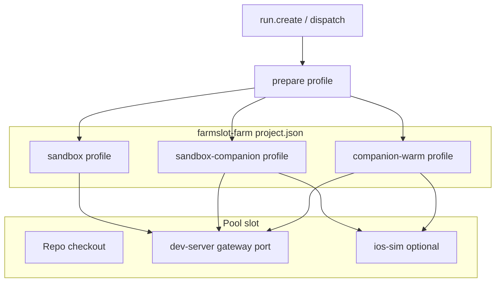

# Farmslot monorepo example

Farmslot dogfoods on itself: this repository is both the framework and a first-party project (`farmslot-farm`). The example shows how pool slots, project hooks, prepare profiles, and optional worktrees fit together in practice — without a separate "companion farm" or parallel naming scheme.

## What you are modeling

| Layer        | File / concept                        | Role                                                                            |
| ------------ | ------------------------------------- | ------------------------------------------------------------------------------- |
| **Pool**     | `pool/<machine>.json`                 | Machines, slots, ports, optional simulators, tmux sessions                      |
| **Project**  | `projects/farmslot-farm/project.json` | Hooks, prepare profiles, fixtures, recipe wiring for Command Center + Companion |
| **Operator** | Main clone or worktree checkout       | Where agents edit code; each slot points at one checkout                        |



## Unified slot rule

All first-party slots share one pattern:

- **Worktree path:** `farmslot-{n}` (e.g. `farmslot-1`, `farmslot-2`) — not `farmslot-companion-*`
- **Platform:** `cli` (gateway is the default stack)
- **Companion / simulator:** optional `resources.ios-sim`; booted only when a prepare profile needs mobile proof
- **Cross-surface tickets:** one slot, `sandbox-companion` — gateway + Metro + sim on demand

Companion is a **surface** (prepare profile + validation step), not a separate pool farm.

## Local demo (fastest path)

The committed demo pool is [`pool/farmslot-demo.json`](https://github.com/deeeed/farmslot/blob/main/pool/farmslot-demo.json):

```bash
bash scripts/dev.sh
```

Open [http://localhost:7777](http://localhost:7777). Slot `demo-ff-1` uses `project: farmslot-farm`, `platform: cli`, and the repo root as its checkout. This is enough to explore Command Center, dispatch preview, and the scripted-runner validation path described in [Local demo and CLI](./local-demo-and-cli.md).

The same pool file also documents `demo-ff-2` — disabled by default — with optional `ios-sim` and a second gateway port. Enable it when you want to practice `companion-warm` or `sandbox-companion` locally without a private machine pool:

```json
{
  "id": "demo-ff-2",
  "enabled": false,
  "platform": "cli",
  "resources": {
    "dev-server": { "port": 7779, "cdp_port": 9325 },
    "ios-sim": { "simulator": "fs-demo-2", "headless": true }
  }
}
```

## Isolated worktree (how real slots work)

Production-style slots point each agent at its own checkout and port block:

```json
{
  "id": "workstation-ff-2",
  "project": "farmslot-farm",
  "platform": "cli",
  "repo": "~/dev/farmslot-wt/farmslot-2",
  "session": "ff-2",
  "resources": {
    "dev-server": { "port": 8809, "cdp_port": 9324 },
    "ios-sim": { "simulator": "fs-2", "headless": true }
  }
}
```

| Field             | Meaning                                                                         |
| ----------------- | ------------------------------------------------------------------------------- |
| `platform: cli`   | Default prepare is gateway-only (`sandbox`)                                     |
| `dev-server.port` | This checkout's gateway WebSocket/HTTP port                                     |
| `ios-sim`         | Optional; idle until `companion-warm`, `companion-full`, or `sandbox-companion` |
| `cdp_port`        | Command Center recipe / CDP probes for this slot (when configured)              |

Simulator names align with slot index (`fs-2` for `farmslot-2`), not a parallel companion namespace.

## Prepare profiles on `farmslot-farm`

Defined in `projects/farmslot-farm/project.json` under `prepare.profiles`:

| Profile             | When to use                               | What boots                                    |
| ------------------- | ----------------------------------------- | --------------------------------------------- |
| `sandbox`           | Gateway / Command Center work             | Gateway on slot port                          |
| `attach`            | Gateway already running                   | Health check only                             |
| `typecheck`         | Static verification, no gateway lifecycle | Typecheck hooks                               |
| `companion-warm`    | Mobile-only proof                         | Metro + dev client (+ sim when configured)    |
| `companion-full`    | Native drift / cold companion build       | Native rebuild then warm                      |
| `sandbox-companion` | **One ticket spans CC + Companion**       | Gateway, then companion warm on same checkout |

CLI examples (replace slot id with yours):

```bash
farmslot slot prepare workstation-ff-2 --prepare-profile sandbox
farmslot slot prepare workstation-ff-2 --prepare-profile sandbox-companion
farmslot slot prepare workstation-ff-2 --prepare-profile companion-warm
```

See [Prepare lifecycle](../reference/prepare-lifecycle.md) for phase ordering and fallbacks.

## Dispatch fit for multi-surface work

When ticket metadata mentions Command Center and Companion, the gateway profile-fit suggestion should prefer `sandbox-companion` on the **dispatch slot** — validation steps for CDP, gateway RPC, and companion recipe all target that slot.

Operator override always wins: if you already set `prepareProfile`, the gate does not replace it.

## Two improvement paths while building Farmslot

| Path             | Use when                                                | Record                         | Prove                                  |
| ---------------- | ------------------------------------------------------- | ------------------------------ | -------------------------------------- |
| **Agent-direct** | Framework bug; repro is a unit test or local command    | GitHub issue (`dogfood` label) | PR + `yarn typecheck` + targeted tests |
| **Run-mediated** | Needs slot, worker, recipe, device, or publication gate | Issue + `run.create`           | Recipe artifacts + gate invariants     |

While the framework is still moving quickly, framework fixes usually land via **agent-direct** work on an isolated worktree branch. Product dogfood (demo banners, cross-surface evidence) uses **run-mediated** dispatch on a configured slot once stabilization checklist items are green.

## Recipe and evidence

First-party recipes live under `docs/examples/recipes/farmslot/`. Task runs invoke:

```bash
bash projects/farmslot-farm/setup/validate-recipe.sh \
  --recipe <path-to-recipe.json> \
  --artifacts-dir <task>/artifacts/recipe-run \
  --gateway-port <slot-port> \
  --slot-id <slot-id>
```

Companion iOS proof adds `--platform ios`, `--simulator <name>`, and Metro derived from the gateway port (typically gateway + 70).

## Related guides

- [Import a project](./import-a-project.md) — generic pool + project shape
- [Local demo and CLI](./local-demo-and-cli.md) — `demo-ff-1` and `farmslot` CLI
- [Prepare lifecycle](../reference/prepare-lifecycle.md) — profile phases and hooks
- [Command Center](../products/command-center.md) — operator surface
- [Mobile Companion](../products/mobile-companion.md) — mobile supervision surface
