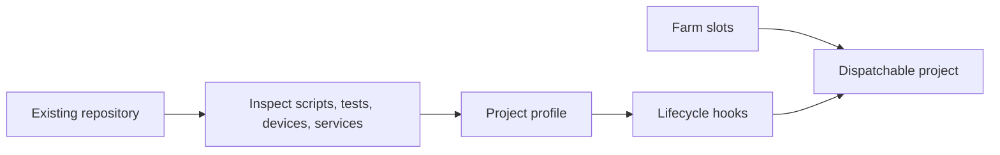
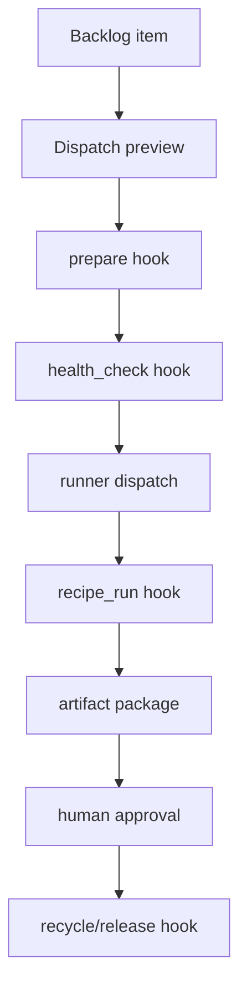

# Import a project

Farmslot should make it practical to bring any software project into the supervised agent loop with small, explicit configuration.

Today, importing a project means describing the project, its slots, and its lifecycle hooks. The long-term goal is prompt-assisted import: point Farmslot at a repository, let an agent propose the project profile, and approve the generated setup instead of hand-writing every detail.

## Import model



## What gets configured

| Area              | Purpose                                                                                               |
| ----------------- | ----------------------------------------------------------------------------------------------------- |
| Project profile   | Names the project, platform, paths, fixture locations, and capabilities.                              |
| Pool slot         | Maps a machine slot to a repo checkout, ports, devices, browser targets, tmux session, and resources. |
| Lifecycle hooks   | Project-owned commands for prepare, health check, dispatch, recipe validation, recycle, and release.  |
| Worker prompts    | Project-owned templates for bug fixing, development, review, PR completion, and merge recovery.       |
| Runner profile    | Decides which runner/model/safety tier should execute each kind of work.                              |
| Evidence contract | Defines what artifacts prove a change worked: screenshots, logs, traces, recipes, diffs, or reports.  |

## Minimal farm setup example

A farm slot points to a checked-out repository and exposes the resources the gateway can reason about:

```json
{
  "$schema": "../schemas/pool.schema.json",
  "machine": "workstation-a",
  "project": "example-webapp-farm",
  "platform": "web",
  "host": "localhost",
  "dispatch_cmd": "cd {repo} && {claude_path} {safety_flags}",
  "slots": [
    {
      "id": "webapp-1",
      "enabled": true,
      "repo": "~/dev/example-webapp-slot-1",
      "session": "webapp-1",
      "resources": {
        "dev-server": { "port": 5173 },
        "browser": { "cdp_port": 9323 }
      }
    }
  ]
}
```

A project profile owns project-specific behavior. The gateway orchestrates hooks, but the project decides how to prepare, validate, and clean itself up:

```json
{
  "name": "example-webapp-farm",
  "platform": "web",
  "hooks": {
    "prepare": "yarn install --immutable && yarn typecheck",
    "health_check": "curl -f http://localhost:{{port}}/health",
    "recipe_run": "yarn validate:recipe --recipe {{recipe_path}} --artifacts-dir {{artifacts_dir}}",
    "recycle": "yarn dev:reset"
  }
}
```

These snippets are intentionally generic. Real projects can add mobile devices, browser profiles, fixture sync, native build steps, backend services, custom validation adapters, and project-owned [worker prompt templates](./customize-worker-prompts.md).

## Configurable flows

Import is not only about starting a runner. A useful project profile defines the flows Farmslot can safely operate:



Common configurable flows:

- **Prepare flow** — install dependencies, sync fixtures, boot services, reserve devices.
- **Health flow** — prove the slot is ready before dispatch.
- **Prompt flow** — render the project-owned task template for bugfix, development, review, PR completion, or merge recovery.
- **Dispatch flow** — launch the selected runner with the rendered prompt, safety tier, and context.
- **Validation flow** — run recipes or project-native tests and emit evidence.
- **Review flow** — attach artifacts, diffs, logs, and cross-runner findings to a human gate.
- **Recovery flow** — recycle a stuck slot, clean runtime state, or ask a runner for a bounded fix.

## Why this matters for large projects

Large open-source or enterprise projects often have many external systems: issue trackers, code hosting, CI, devices, local services, release gates, and team conventions. Farmslot should not require replacing those systems on day one.

The import goal is to centralize the agent-work loop while letting each project keep its own reality:

- external issues and PRs can feed the backlog;
- project hooks encode local setup and validation knowledge;
- slots isolate work across machines and checkouts;
- evidence returns to one review surface;
- learnings improve future imports, prompts, recipes, and recovery policies.

## Long-term import assistant

The eventual import assistant should be able to:

1. inspect repository scripts, docs, test commands, CI config, and local setup notes;
2. propose project hooks and slot resource requirements;
3. suggest initial worker prompts, recipes, and evidence artifacts;
4. generate a safe starter profile;
5. ask the operator to approve or edit the profile;
6. run a dry health check before allowing dispatch.

That keeps Farmslot flexible enough for any project while reducing the friction of bringing new work into the farm.
