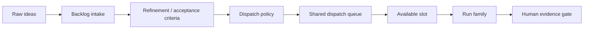

# Backlog and dispatch queue

The backlog and dispatch queue are the bridge between raw intent and available agent capacity.

The long-term vision is that Farmslot can continuously ingest ideas, refine them with the human, break them down into actionable work, and dispatch the right item when a safe slot becomes available.

This area is still an active architecture direction, not a finished contract. The important product intent is that external systems can feed the loop, while Farmslot becomes the central place where intent is refined into supervised agent work.

## Why it matters

Once you have many slots across multiple machines, the bottleneck shifts.

The problem is no longer only “can an agent implement this?” It becomes:

- Which work should run next?
- Is the task scoped enough for an agent?
- Which runner/model/profile should handle it?
- Which project adapter and validation recipe apply?
- Is a slot safe and available?
- What evidence will the operator need at the end?

## Queue model

## Intake paths

Voice capture is one intake path, and the canonical voice-to-backlog flow lives in [Mobile Companion](./mobile-companion.md#voice-to-backlog-vision). Other sources can include GitHub, Jira, issue trackers, docs, meeting notes, or existing project backlogs.

Those systems should be inputs, not the place where the agent-work loop fragments. Farmslot's backlog is where raw intent gets centralized, refined with the operator, broken into dispatchable items, and connected to slots, runners, evidence, and approval gates.

## Human-in-the-loop refinement

Backlog automation should not mean raw ideas go straight to execution. The target loop is collaborative:

1. ingest a rough idea or external issue;
2. ask clarifying questions or propose a breakdown;
3. let the operator adjust priority, scope, risk, and taste;
4. create smaller dispatch candidates with acceptance criteria and evidence expectations;
5. keep only ready work eligible for automatic dispatch.

## Constant roadmap ingestion

The eventual system should behave like a living roadmap queue:

- ideas enter continuously from voice, external systems, and operator notes;
- the system refines, deduplicates, and prioritizes them with the human;
- available slots pull ready work when policy allows;
- evidence returns to the human;
- learnings improve future task generation and validation.

The operator remains in control of judgment and approval, while the mechanical parts of intake, refinement, queueing, dispatch, and evidence collection become continuous.
