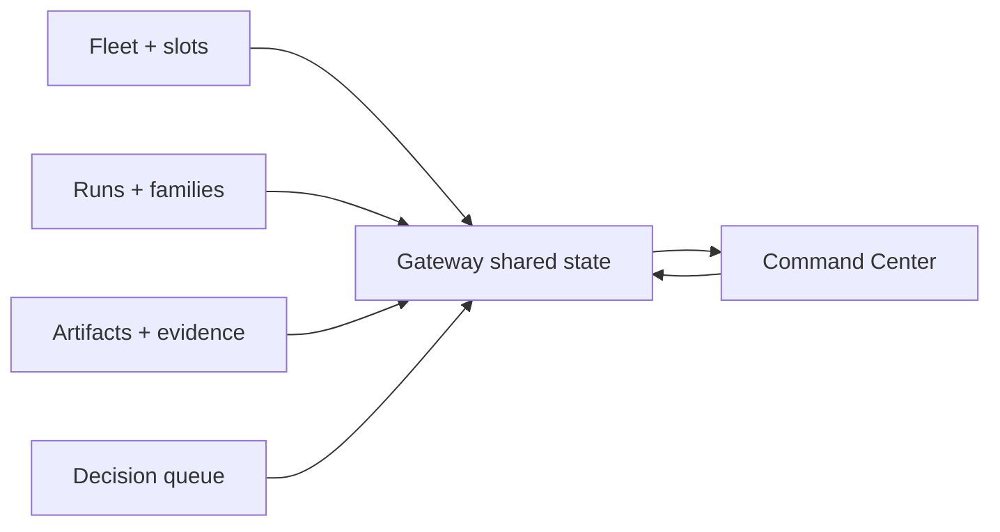

# Command Center

Command Center is the desktop operator surface for Farmslot.

It exists because supervising many agents from one serial chat or a pile of terminal windows does not scale. The operator needs a persistent cockpit for fleet state, run state, evidence, terminals, decisions, and publication gates.

## Core jobs

  
<strong>Fleet overview</strong> Slot health, readiness, machine state, and dispatchability.

  
<strong>Run supervision</strong> Run families, lanes, active work, progress, and status transitions.

  
<strong>Terminal streaming</strong> Inspectable worker panes and live output when intervention is needed.

  
<strong>Evidence review</strong> Artifacts, screenshots, traces, diffs, validation outputs, and recipe proof.

  
<strong>Decision gates</strong> Human approvals before publication, recovery, or high-impact next steps.

  
<strong>Eval/replay</strong> Reference/candidate comparisons for prompts, templates, runners, and harness changes.

## Relationship to the gateway

Command Center is a client of the gateway. It should not invent a second state model.

## Operator workflow

1. See which slots and workers are available.
2. Dispatch or inspect work from a structured surface.
3. Watch live terminals only when needed.
4. Review evidence, diffs, recipe traces, and before/after artifacts.
5. Approve, reject, recover, or ask for another iteration.

## Demo evidence

The illustration above is a docs-safe product mockup. Public demos should use a clean synthetic dataset:

- fleet overview with non-sensitive slot names;
- run detail with a synthetic artifact package;
- evidence workspace with generic before/after media;
- eval comparison with synthetic reference/candidate packages.
