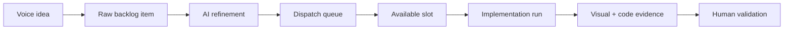

# Mobile Companion

Mobile Companion is the phone-native supervision surface for Farmslot.

It is not intended to replicate every desktop workflow. The target scope is to keep the operator in the loop when away from the desk: awareness, quick decisions, artifact inspection, terminal observation, voice capture, and targeted intervention.

## Try it

Mobile Companion is in early testing. Android access is managed through Google Play testing for `net.siteed.farmslot`; iOS access is managed through TestFlight for the Farmslot app.

If you want access, message Arthur with:

1. your platform: Android, iOS, or both;
2. the email tied to your Google Play or Apple ID;
3. whether you want LAN-only pairing or Tailscale pairing.

After access is enabled, install Companion, open Command Center, choose **Gateway connection → Generate QR**, then scan it from Companion **Settings → Pair QR**.

## Target scope

- Read-heavy fleet and active-run visibility.
- Decision inbox and urgent notifications.
- Artifact, diff, PR, and evidence review on a phone.
- Worker/tmux terminal observation and safe control shortcuts.
- Gateway profile pairing and authenticated LAN/remote connection management.
- Foreground voice nudges and, over time, voice-driven backlog capture.

## Why mobile matters

The product vision is not “more dashboards.” It is keeping the operator's judgment available at the moments where it matters.

Mobile Companion should let Farmslot continue running while the human is not sitting in front of the desktop. The operator can validate final evidence, nudge a stuck worker, or capture a new idea from voice without context-switching back into the full IDE.

## Voice-to-backlog vision

This page owns the canonical voice-to-backlog flow. The longer-term loop is:

The operator should be able to capture raw ideas by voice, let the system refine them into implementation-ready backlog items, and dispatch them automatically when safe capacity becomes available.

## Scope discipline

Mobile should optimize for quick supervision and intervention:

- approve or reject;
- inspect before/after evidence;
- observe or nudge a worker;
- capture intent;
- check run health.

Heavy code editing and deep configuration stay on desktop.
