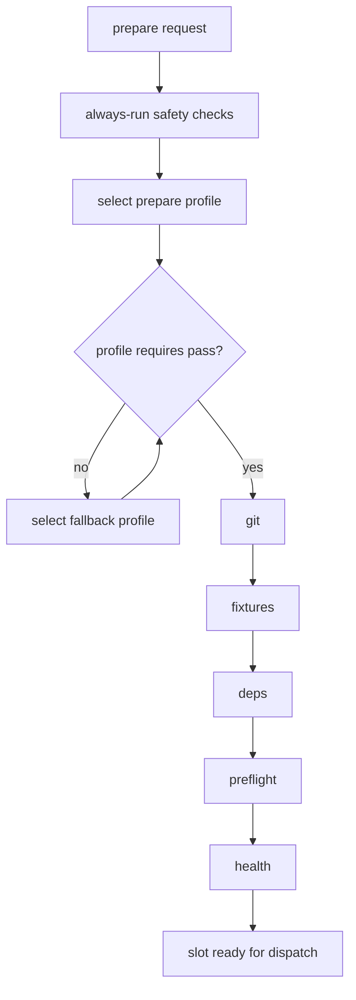

# Prepare lifecycle

Prepare is the gateway-owned lifecycle stage that turns a selected slot into a
known runnable state before dispatch. Projects keep ownership of
project-specific commands, while Farmslot owns the orchestration contract: slot
checks, phase ordering, profile selection, fallbacks, logging, and run state.

Use prepare profiles when a project has more than one valid entry point. A
project might have a full cold prepare, a fast "reuse current runtime" prepare,
or a cheap static-only prepare that only verifies files and dependencies.

## Prepare model



The selected profile decides which predefined framework phases run. The phase
vocabulary and order are fixed even when a profile omits phases:

1. `git`
2. `fixtures`
3. `deps`
4. `preflight`
5. `health`

Farmslot still runs safety checks outside the profile phase list. These include
slot reachability, project config loading, device existence checks, prepare
sentinel locking, tmux session setup, and git origin/default-branch guards when
git work is required.

## Bundled phases

Prepare phases are bundled into the Farmslot flow. A project can select a subset
of the predefined phases, but it cannot add new phase names or reorder them in
`project.json`. Unknown phase names are rejected by the schema and by gateway
config validation.

This keeps prepare observable and comparable across projects: the UI, run
engine, retry actions, profile fallbacks, and recovery logic can all reason
about the same phase names.

Project-specific work should usually live inside the nearest existing phase:

| Project need                                                                                              | Put it here                                                     |
| --------------------------------------------------------------------------------------------------------- | --------------------------------------------------------------- |
| Generate worker files, runtime context, seed data, or harness files.                                      | `fixtures` or fixture mappings.                                 |
| Install packages, pods, gems, toolchains, or generated dependency artifacts.                              | `deps` via the dependency install hook.                         |
| Boot simulators, start dev servers, build/install apps, open browsers, warm bundles, seed local services. | `preflight` or a profile-specific `preflight` override.         |
| Prove readiness, unlock app state, check routes, verify ports, assert login/session health.               | `health` through `health_check`, parsing, and ready indicators. |

A new first-class phase is only necessary when Farmslot itself must observe,
skip, retry, time out, cache, or display that work independently across
projects. In that case, it is a framework change: update the protocol constants,
schema, config validation, prepare execution order, UI labels, tests, and docs.
It is not something an individual project can declare ad hoc.

## Phase contract

| Phase       | Purpose                                                                                            | Typical project hook or behavior                                          |
| ----------- | -------------------------------------------------------------------------------------------------- | ------------------------------------------------------------------------- |
| `git`       | Put the worker repo on the requested branch, create/reset branches, and apply run-level git flags. | Gateway git operations plus branch policy.                                |
| `fixtures`  | Sync Farmslot-managed project fixtures, worker prompt files, runtime context, or harness files.    | Framework fixture sync from the project config.                           |
| `deps`      | Install dependencies and record the lockfile hash that proves the installed tree is current.       | `post_merge_install` or equivalent dependency install hook.               |
| `preflight` | Do project-specific runtime setup that should happen after code/deps are ready and before health.  | `preflight` hook, optionally overridden by the selected profile.          |
| `health`    | Prove the prepared slot is ready for dispatch.                                                     | `health_check`, optional `health.parse_health`, `health.ready_indicator`. |

Skipping a phase means Farmslot does not perform that work for this prepare
request. It does not mean the slot cannot already satisfy that condition. Cheap
profiles should use `requires` to prove the assumed state before relying on it.

## Profile selection

Profiles live in `project.json`:

```json
{
  "prepare": {
    "default": "full",
    "profiles": {
      "full": {
        "phases": ["git", "fixtures", "deps", "preflight", "health"]
      },
      "attach": {
        "label": "Attach to running app",
        "description": "Only verify an already-running app; fall back if health is missing.",
        "phases": ["health"],
        "requires": ["health_ok"],
        "fallback": "full"
      }
    }
  }
}
```

Farmslot resolves the starting profile in this order:

1. Explicit `prepareProfile` from CLI, RPC, dispatch wizard, or replay action.
2. `prepare.default`.
3. A profile literally named `full`.
4. A built-in implicit `full` profile when the project declares no `prepare`
   block.

Unknown explicit profile names fail prepare. Profile names must use lowercase
letters, numbers, and dashes, and must start with a letter.

`label` is the operator-facing button/list text. `description` is longer help
text for tooltips and documentation. The profile key remains the stable value
stored in run metadata and sent to prepare hooks.

## Preconditions and fallback

`requires` defines framework-owned checks that must pass before a cheap profile
can run. If any check fails, Farmslot selects the profile named by `fallback` and
checks that profile. Fallback chains must terminate and cannot contain cycles.

| Requirement          | Meaning                                                                                                                                                                                                                                                                                                                                                         |
| -------------------- | --------------------------------------------------------------------------------------------------------------------------------------------------------------------------------------------------------------------------------------------------------------------------------------------------------------------------------------------------------------- |
| `deps_current`       | The current lockfile hash matches the sentinel written by `deps`.                                                                                                                                                                                                                                                                                               |
| `dev_server_up`      | The project `dev_server_check` hook exits successfully.                                                                                                                                                                                                                                                                                                         |
| `health_ok`          | The project `health_check` pipeline returns the configured ready value.                                                                                                                                                                                                                                                                                         |
| `artifact_available` | The project `artifact_check` hook exits 0 — a fast, seconds-scale probe reporting whether the profile's prebuilt artifact could be resolved (never a download or install). The run's target ref (work branch, else default branch) is threaded to the hook as `{{prepare_ref}}` so the probe checks the ref the run will run, not the slot's pre-checkout HEAD. |

This makes warm reuse explicit. A profile such as `attach` says: "reuse the
current runtime only if health is already good; otherwise fall back to a full
prepare."

## Hook overrides

A profile can override project hooks for that prepare run:

```json
{
  "prepare": {
    "profiles": {
      "full": {
        "phases": ["git", "fixtures", "deps", "preflight", "health"]
      },
      "relaunch": {
        "label": "Switch branch + relaunch app",
        "description": "Reuse installed native artifacts while refreshing JS runtime state.",
        "phases": ["git", "fixtures", "preflight", "health"],
        "requires": ["deps_current", "dev_server_up"],
        "fallback": "full",
        "hooks": {
          "preflight": "bash {{farmslot_dir}}/projects/example/scripts/relaunch.sh '{{slot_id}}'"
        }
      }
    }
  }
}
```

Unspecified hooks resolve from the top-level project `hooks` block. Hook
overrides are useful when the runtime can be repaired incrementally instead of
rebuilt. If a profile overrides `preflight`, that hook owns its own runtime
cleanup; Farmslot does not do the default dev-server port cleanup before it.

Project lifecycle hooks receive `FARMSLOT_PREPARE_PROFILE=<name>`, so a project
can either use hook overrides or keep one hook script that branches internally.

### Runtime ensure profiles

A common profile is an "ensure runtime" prepare: update code and generated
context, install stale dependencies, then make the existing runtime reachable
without doing the most expensive rebuild. For Mobile/Expo that can mean boot the
simulator, start or reuse Metro, prewarm the JS bundle, open the installed dev
client, and wait for the bridge. If the native dev client is missing, this
profile should fail clearly instead of silently running a native build.

```json
{
  "prepare": {
    "default": "ensure-js-runtime",
    "profiles": {
      "ensure-js-runtime": {
        "label": "Ensure JS runtime",
        "phases": ["git", "fixtures", "deps", "preflight", "health"],
        "hooks": {
          "preflight": "bash {{farmslot_dir}}/projects/mobile/scripts/recipe-hook.sh prepare --repo '{{repo}}' --platform '{{platform}}' --port '{{port}}' --runtime-dir '{{runtime_dir}}' --preflight-mode fast"
        }
      },
      "full": {
        "label": "Full native prepare",
        "phases": ["git", "fixtures", "deps", "preflight", "health"]
      }
    }
  }
}
```

The important boundary is the same for any project type: Farmslot selects the
profile and orders the phases; the project hook owns the meaning of "ensure" for
that runtime. A web app might ensure the browser and dev server are open. A
backend might ensure containers and workers are up. A mobile project might
ensure the JS bundle and installed dev client are ready.

## `skipPrepare` is different

`skipPrepare` is not a profile. It means no prepare work runs at all and the
operator or engine fully owns the slot state. Farmslot does not attach health
gating to `skipPrepare`.

Use profiles for verified reuse:

```json
"attach": {
  "phases": ["health"],
  "requires": ["health_ok"],
  "fallback": "full"
}
```

Use `skipPrepare` only when another part of the engine has already prepared the
same slot, or when an operator deliberately wants to dispatch into the current
state without checks.

## Mapping to project types

The phase names are intentionally generic. Their concrete meaning depends on
the project:

| Project type      | `fixtures`                                                      | `deps`                                                                         | `preflight`                                                                       | `health`                                                      |
| ----------------- | --------------------------------------------------------------- | ------------------------------------------------------------------------------ | --------------------------------------------------------------------------------- | ------------------------------------------------------------- |
| Web app           | Write env files, browser profile config, seeded local data.     | `npm install`, `pnpm install`, `bundle install`, codegen.                      | Start or reuse Vite/Next/Rails/etc., open a browser profile, seed local services. | HTTP health route, browser route check, CDP page readiness.   |
| Backend/API       | Write test config, local secrets, fixture DB dumps.             | Install packages, build generated clients, run migrations needed by local dev. | Start API, worker, queue, database container, or compose stack.                   | HTTP `/health`, port check, smoke query, queue readiness.     |
| CLI/library       | Write task files, test fixtures, local config.                  | Install packages, build generated artifacts, compile native extensions.        | Optional build step, cache warmup, local daemon start, or no-op.                  | Run a cheap command, import check, version check, smoke test. |
| Browser extension | Write extension profile, browser profile, fixture wallet state. | Install packages and build dependencies.                                       | Build/load extension, launch browser, attach CDP target.                          | Extension page/background readiness, route/state check.       |
| Mobile app        | Write runtime context, wallet/device fixtures, harness files.   | Install JS/native deps, pods, Gradle caches.                                   | Boot simulator/emulator, start Metro, build/install/launch app.                   | App route/bridge readiness, device/app health check.          |

Common profile shapes also translate across project types:

| Profile shape   | Phases                                           | Meaning                                                                                |
| --------------- | ------------------------------------------------ | -------------------------------------------------------------------------------------- |
| `full`          | `git`, `fixtures`, `deps`, `preflight`, `health` | Unknown or cold state; rebuild the slot into a known ready state.                      |
| `runtime-reuse` | `git`, `fixtures`, `preflight`, `health`         | Dependencies are current; update code/config and repair or relaunch runtime.           |
| `attach`        | `health`                                         | Runtime is already up; verify it before dispatch.                                      |
| `static`        | `git`, `fixtures`, `deps`                        | No live runtime is needed; useful for code-only analysis, libraries, or static review. |

For a project with no live runtime, `preflight` and `health` can be omitted from
the relevant profile. For a project with several services, `preflight` can start
or reconcile all of them, while `health` should provide a cheap readiness proof
that the worker can trust before dispatch.

## Observability

Prepare records sub-steps on the run:

- selected profile and fallback reasons;
- skipped phases with the active profile name;
- hook log paths for dependency install and preflight;
- health values and ready-indicator mismatches.

The prepare tmux window is named with the run label when possible, so operators
can attach to the slot session and inspect long-running dependency or preflight
work while the run detail page receives structured progress.

## Related files

- Schema: `schemas/project.schema.json`
- Protocol constants: `packages/protocol/src/contracts/config.ts`
- Profile selection: `services/gateway/src/methods/slot/prepare-profile.ts`
- Phase execution: `services/gateway/src/methods/slot/prepare.ts`
- Run-engine skip behavior: `services/gateway/src/run-engine/dispatch-lifecycle-steps.ts`
