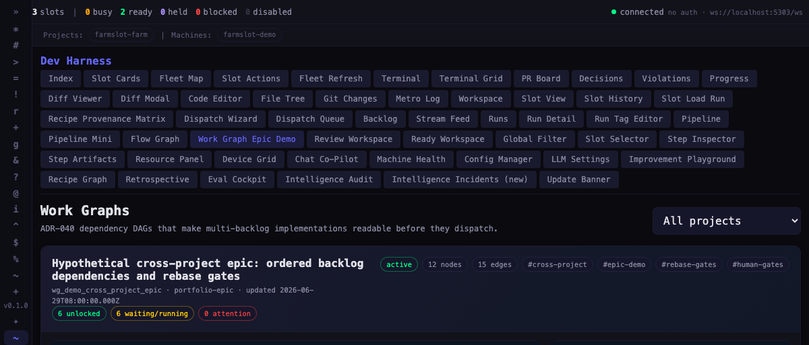

# Work graph epic demo

Status: example fixture supporting ADR-040 work graph orchestration and ADR-041 roadmap refinement.

This example explains the read-only **Graphs** UI with a hypothetical cross-project Farmslot epic:

> rough idea → backlog items + external blockers → dependency edges → run families → rebase/human gates → rollout

The demo is intentionally fixture-backed. It does not enqueue runs or mutate real worktrees.

## Open the demo

```bash
cd apps/command-center
yarn farmdev
```

Then open:

```text
http://localhost:5174/#dev/work-graph
```

For a screenshot-ready browser session:

```bash
FARMSLOT_UI_URL=http://localhost:5174/#dev/work-graph \
  bash apps/command-center/scripts/debug-chrome.sh
```

To capture the page through CDP:

```bash
FARMSLOT_CDP_PORT=9323 \
  node apps/command-center/scripts/cdp.mjs screenshot dev/work-graph \
  docs/examples/assets/work-graph-epic-demo.png
```



## The model

- **Graph nodes are backlog items or references.** Backlog nodes are dispatchable Farmslot work. Reference nodes are external blockers/milestones such as Jira, GitHub PRs, package publishes, or manual release gates; they are never dispatched.
- **Backlog items may belong to different projects.** The demo uses roadmap, protocol, gateway, CLI, Command Center, Companion, validation, docs, and release-ops projects.
- **Edges define ordering and gates.** An edge says what upstream condition must happen before a downstream item can start, continue, rebase, enqueue, or be marked ready.
- **Some work can start before all edges are satisfied.** Example: UI and Companion can start from the shared contract, but they cannot complete until the gateway projection merges and they rebase.
- **Human approval is an edge condition.** A manual gate blocks downstream work without becoming a fake backlog item.
- **Columns are inferred dependency depth.** They are layout only, not a product-specific stage field.

## How to read the graph

- **Each box is a work node.** Backlog boxes link to specs/runs. Dashed purple reference boxes link to external refs/evidence.
- **Left-to-right columns show dependency depth.** Items with no prerequisites are leftmost; deeper items depend on upstream backlog items.
- **Arrows are graph edges.** Edge labels explain the condition and unlock action, for example `merged main → rebase` or `upstream success → enqueue`.
- **Green means unlocked/satisfied.** Example: the refined idea and shared contract are complete.
- **Yellow means active/waiting.** Example: gateway is running, CLI is queued, release waits on gates.
- **Red means attention needed.** Example: authoring controls are gated behind UX review.
- **Click a node** to inspect project, backlog id, flow, family id, latest run id, base ref, failure policy, notes, inputs, and unlock actions.

## What the hypothetical epic shows

| Backlog item                                     | Project            | Dependency meaning                                                                             |
| ------------------------------------------------ | ------------------ | ---------------------------------------------------------------------------------------------- |
| Refine raw idea into backlog-ready epic plan     | roadmap            | First backlog item created from ideation/refinement.                                           |
| Define shared graph/backlog contract             | platform-protocol  | Starts after refinement; downstream work reads this contract.                                  |
| Expose backlog dependency graph projection       | gateway            | Starts after contract; downstream items may need to rebase after it merges.                    |
| Build read-only graph visualization              | command-center     | Can start from contract/fixtures; cannot complete until gateway projection merges and rebases. |
| Show epic dependency status on mobile companion  | companion-app      | Can start from contract/fixtures; cannot complete until gateway projection merges and rebases. |
| Import markdown backlog specs into a graph       | cli                | Cannot start until gateway projection exists; edge unlocks by enqueue.                         |
| Add graph authoring controls                     | command-center     | Starts only after visualization plus human UX gate.                                            |
| Validate cross-project graph workflow end to end | validation-recipes | Waits for CLI, authoring, companion status, and evidence gates.                                |
| Document graph semantics with screenshots        | docs               | Can proceed independently from the stable fixture.                                             |
| External core controller PR merged               | metamask-core      | Reference blocker; client completion waits for this external PR, but Farmslot does not own it. |
| Shared package version published                 | npm                | Reference milestone; release can proceed once this package publish is recorded.                |
| Roll out epic after evidence and gates pass      | release-ops        | Final backlog item; waits on E2E evidence and docs/manual gates.                               |

## Why this exists

The production `#work-graphs` route is read-only today: it visualizes graph data already created by the gateway. The `#dev/work-graph` fixture gives a stable, screenshotable example so operators and reviewers can understand how one feature becomes multiple dependency-linked backlog items before authoring/refinement controls exist.

The important generalization is not “Core/Mobile/Extension” or any specific project taxonomy. The important abstraction is: **a backlog item can depend on another backlog item or a non-dispatchable external blocker for start, rebase, validation, human approval, or release readiness.**
