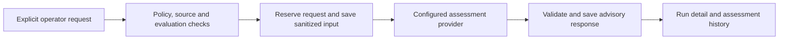

# On-demand failure advice

This disabled-by-default pilot assesses approved text from a recorded failed
Farmslot development step. It returns a cause and a fixed read-only diagnostic.
It never updates the run verdict or starts recovery. Provider credentials stay
on the gateway.

The [frozen evaluation](failure-triage-evaluation.md) passes its original pilot
gate, but a cheap rule suited to its synthetic format scored slightly higher.
Production accuracy and workflow efficiency remain unproven. The model's separate
next-check answer was weak; the pilot derives guidance from the fixed cause map.



## Configure a bounded pilot

Use the gateway host and its `FARMSLOT_ROOT`, `FARMSLOT_HOME` and log environment.
Enable the existing assessment setting and select an explicit provider/model.
A key alone never enables triage. Keep `triage-policy.json` absent, or set
`{"enabled": false}`, to disable it independently.

First export a recorded failed development run through the existing authenticated
RPC helper, pointing `FARMSLOT_GATEWAY` at the intended gateway:

```bash
node apps/command-center/scripts/cdp.mjs gateway run.get \
  '{"runId":"<run-uuid>"}' > /tmp/triage-run.json
TSX_TSCONFIG_PATH=services/gateway/tsconfig.json node --import tsx \
  scripts/failure-triage/draft-approval.mts --run-json /tmp/triage-run.json --list
```

Choose registered source IDs and declare their public or synthetic provenance:

```bash
TSX_TSCONFIG_PATH=services/gateway/tsconfig.json node --import tsx \
  scripts/failure-triage/draft-approval.mts --run-json /tmp/triage-run.json \
  --source '<registered-log-id>' --origin public \
  --reference 'https://example.org/immutable-source-reference' \
  --out /tmp/triage-approval.json
```

The draft command makes no provider call and does not change policy. Review its
`sanitizedPreview`; the origin declaration is an operator approval of those exact
source bytes. It is not inferred from a project name or a client checkbox.
Changing the recorded failure or source contents requires a new approval.
Nested runtime logs are discoverable only when canonical step outputs disclose
them through the existing log registry.

Copy the reviewed `approval` into `approvals` in
`<FARMSLOT_HOME>/triage-policy.json`:

```json
{
  "enabled": true,
  "projects": ["farmslot-farm"],
  "receiptDirectory": "/absolute/path/to/scripts/failure-triage/results/v2-held-out",
  "maxCalls": 10,
  "maxUsd": 0.1,
  "price": {},
  "approvals": []
}
```

Replace `price` with a verified, current price snapshot in the format of
`scripts/failure-triage/prices.json`; the empty example cannot make a call.
Receipts are checked by hash and the evaluation gate is recalculated. Only the
provider/model/rubric covered by that receipt is admitted. Pricing older than
seven days, unknown pricing and paid-output models without a supported bound
block requests.

The policy permits at most 60 reservations and USD 0.10 per UTC day across
operators, with smaller configured limits respected. Each request reserves the
full supported context cost, including uncertain charges. There is one attempt,
a ten-second deadline, no hidden retry and no fallback model. Required text must
fit the lower of the configured input limit and 12,000 bytes; it is never
silently truncated. A missing or different returned model rejects the response
and leaves its charge unknown.

## Request and inspect advice

Open the run containing the failed step and expand **Experimental failure advice**, or use the
checkout-local CLI from `apps/command-center`:

```bash
yarn farmslot rpc intelligence.triage.get '{"runId":"<run-uuid>"}'
yarn farmslot rpc intelligence.triage.analyze \
  '{"runId":"<run-uuid>","snapshotHash":"<hash-from-get>"}'
```

The methods require an authenticated administrator. They accept identities,
not arbitrary paths, raw terminal buffers or provider keys. Use `step` to select
a particular failed step; otherwise the latest failed step is selected.

The panel distinguishes configuration/data blocks, analysis, unavailable results,
unclear causes, completed responses and stale snapshots. It shows the requested
and returned models, evidence identities, usage, latency and estimated cost.
**Show assessed text** reads the saved sanitized packet. This is text-only advice.
A completed response is not proof that the failure was fixed.

Simultaneous identical requests share one attempt. Cached advice keeps its
original model and timestamp. An interrupted attempt is returned as uncertain
after restart, with no replay. **Retry advice once** sends `retryOf` referencing
that unavailable/interrupted record, or a skipped/disabled record confirmed to
have made no provider call. Repeating that retry identity is also idempotent. A successful retry becomes the cached result.

Correct/incorrect/insufficient-context feedback updates only the advisory record.
**I used this advice** is an explicit operator declaration. These labels are
observational, not independent reference truth or training data.

## Observe impact and verify behavior

The shared assessment history includes `failure-triage` alongside historical
consumers, grouped by provider/model, rubric and run/evidence snapshot. It retains
all attempts and distinguishes confirmed invocation from historical uncertainty.
Unknown usage or charges are not zero. Sanitized inputs and records have bounded
storage and 30-day retention.

Provider latency and recorded assessment duration are diagnostics. Neither is a
workflow-efficiency measurement. Paired baseline/assisted tasks at equal independently
adjudicated quality are still required; no minutes or tokens saved are inferred
from confidence, feedback or successful transport.

`scripts/runner-validation/failure-triage-pilot.recipe.json` drives an owned
gateway with simulated provider responses. It checks two-client coalescing,
restart/crash behavior, explicit retry, source tampering, feedback, authorization,
budgets and unchanged run authority. It makes no external provider call. Browser
checks must use that gateway and normal run-detail interactions, not injected UI
state. Keep ordinary gateway configuration disabled after testing.

For repeatable browser validation, start the gateway proof with `--keep`, point an
isolated UI at that gateway and use an owned CDP browser. Then run:

```bash
TRIAGE_PILOT_PROOF_OUT=/tmp/<kept-proof> FARMSLOT_UI_URL=http://localhost:<ui-port> \
  FARMSLOT_CDP_PORT=<cdp-port> node scripts/runner-validation/gateway/failure-triage-browser.mjs
```

This drives real login, expansion, assessment, feedback and evidence controls,
verifies cached reads make no call, and captures a screenshot. Provider responses
remain explicitly simulated. Stop only the owned proof gateway/UI afterward.

An explicit `--live-smoke` option runs the simulated checks, then sends one fresh
synthetic snapshot through the real provider. It requires a gateway-host key,
saves `live-smoke.json`, and stops its gateway. It cannot be combined with
`--keep`. This checks wiring only and never contributes to the frozen benchmark.
