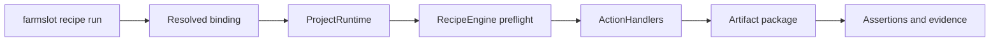

# Recipe concepts

This reference explains the recipe model behind the checkout CLI and hosted execution. It supports the recipe protocol and SDK contracts. Keep it current when those contracts change.

A project ships one **ProjectRuntime**. It identifies the target, checks readiness, manages owned processes, captures supported evidence and supplies an **ActionCatalog**. The catalog pairs strict action declarations with executable code. An **ActionHandler** executes one declared action. The shared **RecipeEngine** checks and runs the recipe graph using those handlers.

A recipe names actions, parameters, assertions and teardown. A passing action call alone does not prove its effect. Assertions and retained artifacts must establish the recipe's claim.

Use `farmslot doctor --conformance` to check a binding and `farmslot recipe actions` to inspect its action catalog. `--action <name>` shows one action's inputs. `recipe call <action> [key=value ...]` and `recipe run <ref|file> [key=value ...]` execute through the same authorized provider. `run --plan` checks the complete plan without executing actions.



The [browser provider example](../examples/projects/browser-example/README.md) attaches the shared UI transport to an explicitly selected existing page. Its recipe presses a control, asserts the resulting URL and retains HUD evidence.

The declaration has three existing parts. `pack.json` describes onboarding, `project.json` describes project behavior, and pool bindings select machine targets, ports and devices. The resolved binding joins project, app, domain, runtime, target, libraries and output paths. Explicit flags take priority, followed by the checkout binding, pool slot, unique detection and configured defaults. Subdirectory lookup starts at the Git root. An ambiguous selection refuses execution.

Projects can compose several team libraries in declaration order. A library keeps its owner, pinned source and version requirements. A namespaced recipe reference selects a library; the first source wins for a bare reference. Dependency and parameter checks cover cross-library calls. The report records precedence winners and shadows, so a local override is visible.

Discovery can read project metadata without importing code. Runtime loading requires an installed or explicitly authorized source. Engine authorization also checks the resolved execution plan. Funding, reset, profile deletion and publication authority stay explicit. Hosted leases belong to the gateway.

Capabilities describe one project, app, runtime and target. Their states are `declared`, `verified`, `failed` or `unknown`. `registered` means the project declaration is available. `recipe-verified` needs current positive recipe evidence. Unsupported operations remain visible; a web result cannot verify Android.

Conformance reports bind checks to the checkout SHA and dirty bytes, provider and library code, configuration, target and timestamp. Static preflight checks dependencies, parameters, handlers and authorization. Live checks add bounded effects and teardown evidence. Changed inputs make a report stale. Missing required evidence cannot pass, and HUD or capture claims apply only where supported.

`farmslot doctor <checkout> --conformance` checks the resolved provider and catalog without launching the app or executing actions. It writes `conformance-report.json` under the project's artifact directory. With no recipe selector it checks every catalog recipe. Use `--recipe <ref>` and repeatable `--param key=value` for a specific parameterized invocation. A required parameter, handler or authorization that is missing fails the check.

A project declares its executable provider and ordered library sources in `project.json`:

```json
{
  "recipe": {
    "provider": {
      "module": "@example/project-runtime/provider",
      "package": "@example/project-runtime"
    },
    "adapter": "web",
    "domain": "catalog",
    "libraries": [
      {
        "name": "catalog",
        "source": { "env": "CATALOG_LIBRARY_ROOT" },
        "revision": "0123456789abcdef0123456789abcdef01234567",
        "owner": "catalog-team"
      }
    ]
  }
}
```

Set `CATALOG_LIBRARY_ROOT` in the selected pool environment to a separate library checkout and replace the example revision with that checkout's full commit SHA. String library paths resolve from the project directory. Repository sources need an exact `revision`; a local `--library name=path` override records the source it replaces. Registered project configuration authorizes its provider. Discovered checkout metadata requires `--authorize-provider <module>` unless it names an installed provider package. Authorizing a provider does not bypass recipe-plan or domain authorization.

Executable library sources need registered project configuration, `--library name=path`, `RECIPE_LIBRARY_PATH`, or the operator's configured personal library. Authorizing a discovered provider alone does not authorize libraries found in checkout metadata. Engine trust checks still apply to every source.

Provider `root` and library `source` can reuse portable `{ "env": "EXAMPLE_PACKAGE_ROOT" }` or `{ "projectPath": "recipe-library" }` references. The first reads the operator environment or selected pool env; the second resolves from the checkout. Discovered metadata cannot resolve those references until the project is registered. This supports globally installed provider packages without home-path defaults.

The original standalone invocation with `--action-manifest` and `--artifacts-dir` retains core-only execution and its optional `--project-root`. Adding project options such as `--target` selects the provider path; explicit `--project-root` selects standalone execution. Its `--library-source` and exact-plan trust options keep their prior behavior while callers migrate. It refuses the project-only preview flags; use a registered provider with `--target` and `--library name=path` for those operations.

Recipe state uses `--runtime-dir`, then `RECIPE_RUNTIME_DIR`, then `temp/recipe/runtime` relative to the target. The farm worker directory in `paths.runtime_dir` is separate. The artifact directory in `paths.artifact_dir` resolves from the checkout root, including when an app is selected.

Reports include native checkout sources as well as application code. A direct recipe file and its adjacent task library are bound to the checked invocation, including its parameters. Changing any of those inputs requires a new check.
