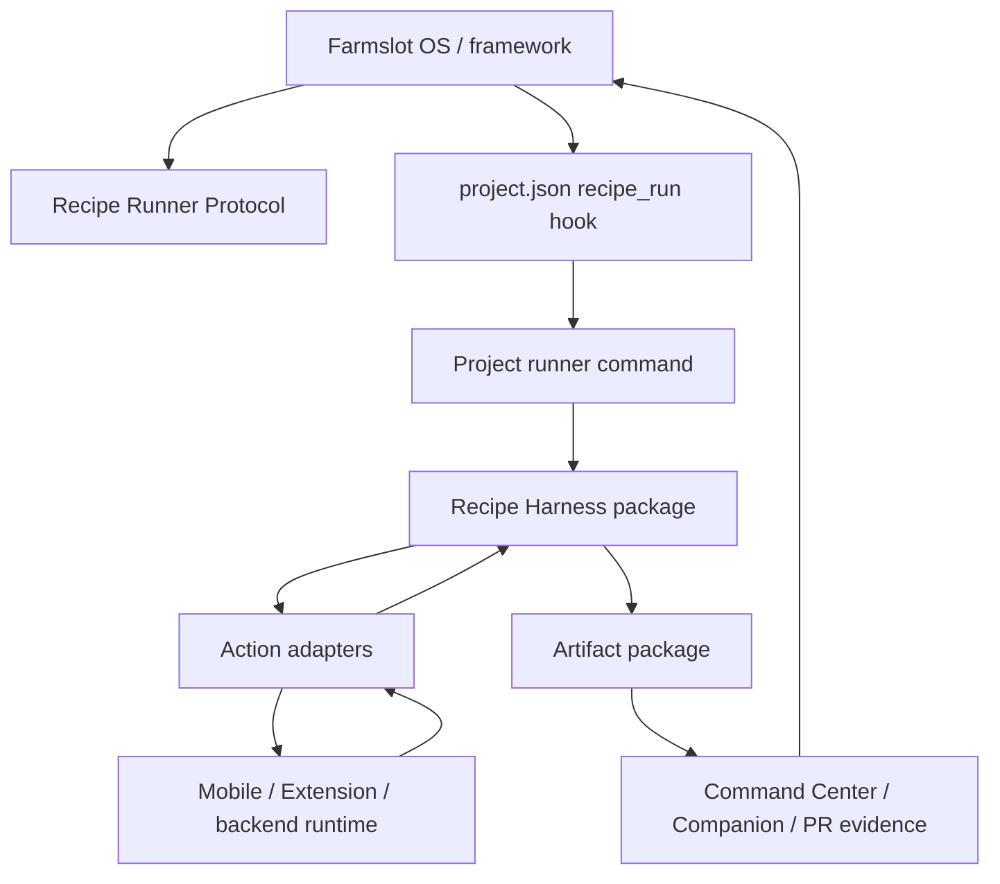
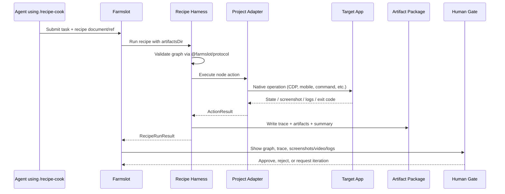

# Recipe Harness — High-Level Explainer

Status: planning reference for the production recipe harness. No implementation is assumed by this document.

Use this as the easy-to-explain version of [reference/recipe-harness-architecture.md](recipe-harness-architecture.md).

## One sentence

Farmslot is the local OS for agentic engineering; projects plug into it by accepting a recipe graph, executing project-native actions through adapters, and returning a typed evidence package that Farmslot can review, replay, and compare.

## Mental model

```text
Farmslot = OS / framework
Recipe Runner Protocol = v1 project contract
Recipe Harness = runtime kernel for proof execution
Project Adapters = drivers for each app/repo/platform
Artifact Package = filesystem evidence API
Command Center / Companion = review UI
/recipe-* skills = agent workflow layer
```

## Key terms — OS, protocol, harness, runner, adapter

These terms should be used consistently in presentations and implementation docs.

### Farmslot OS / framework

**Farmslot OS** is the whole system around agentic work:

- fleet and slot management;
- dispatch queue;
- worker/session lifecycle;
- backlog, eval, replay, and human gates;
- Command Center and Mobile Companion;
- recipe evidence consumption.

It answers: **where does work run, how is it tracked, and where does a human validate it?**

### Recipe Runner Protocol

**Recipe Runner Protocol** is the v1 contract projects implement to plug into Farmslot.

It defines:

- recipe graph envelope (`validate.workflow`);
- runner invocation expectations;
- mandatory output files (`summary.json`, `trace.json`, `artifact-manifest.json`);
- typed artifact manifest semantics;
- v1 contract validation.

It answers: **what must a project provide so Farmslot can understand recipe proof?**

### Recipe Harness

**Recipe Harness** is the reusable runtime package that implements the protocol.

Package shape:

```text
@farmslot/protocol        spec types + validators
@farmslot/recipe-harness  reusable runner + artifact writers + CLI
project adapters          ui/app/cdp/custom bindings
```

It owns:

- loading/validating recipe documents;
- traversing workflow graphs;
- invoking action adapters;
- writing `summary.json`, `trace.json`, and `artifact-manifest.json`;
- returning a `RecipeRunResult`.

It should be good enough for simple projects to use directly. A backend or CLI
project can provide a manifest and use the built-in `command`, `assert_*`,
`watch_logs`, and `index_artifacts` adapters. UI/native/browser projects add
only the adapters that bind `ui.*`, `app.*`, or `cdp.*` to their control
surface. Domain projects add namespaced custom actions such as
`example.wallet.*`.

It answers: **how does a recipe actually execute and produce evidence?**

### Project runner

A **project runner** is the project-owned command or script that Farmslot calls through `project.json`.

Example shape:

```json
{
  "hooks": {
    "recipe_run": "<project command> --recipe {{recipe_path}} --artifacts-dir {{artifacts_dir}}"
  }
}
```

The project runner may:

- call the shared Recipe Harness package directly;
- wrap an existing Mobile/Extension recipe runtime;
- normalize a project-native recipe into the Farmslot recipe contract;
- register project-specific adapters.

It answers: **what command does this project expose to run recipe proof?**

### Action adapter

An **action adapter** executes one recipe node action.

Examples:

- `command`;
- `assert_json`;
- `index_artifacts`;
- Mobile tap/wait/screenshot;
- Extension CDP DOM/state check;
- project test tools invoked through `command` or declared custom actions.

It answers: **how does this node interact with the actual app/runtime?**

### Example App `/recipe-harness` skill

The Example App `/recipe-harness` skill is an operator/agent-facing installer and verifier for Mobile/Extension runtime overlays.

It is not the same thing as the shared Recipe Harness package, but it composes with it:

```text
Example App /recipe-harness skill
  -> installs/verifies Example Mobile App/Extension runtime overlays
  -> owns Example App-specific setup knowledge
  -> calls/installs the shared Recipe Harness package where useful
```

So:

```text
Farmslot OS          = whole agentic work system
Recipe Runner Protocol = spec/contract
Recipe Harness      = shared runtime implementation of the spec
Project runner      = project-owned command hook Farmslot invokes
Action adapter      = per-action implementation used by the harness/runner
/recipe-harness skill = Example App-facing installer/operator workflow
```

## How the terms compose



## The big picture

```mermaid
flowchart LR
  Human[Human / Jira / PR intent]
  Skills[/recipe-* skills]
  Farmslot[Farmslot OS<br/>dispatch, slots, gates]
  Protocol[Recipe Runner Protocol<br/>validate.workflow + artifacts]
  Harness[Recipe Harness<br/>runtime execution]
  Adapters[Project Adapters<br/>Mobile, Extension, backend]
  App[Target project runtime]
  Artifacts[Typed Artifact Package<br/>summary trace manifest media logs]
  Review[Human Review Surfaces<br/>Command Center / Companion / PR]

  Human --> Skills
  Skills --> Farmslot
  Farmslot --> Protocol
  Protocol --> Harness
  Harness --> Adapters
  Adapters --> App
  App --> Adapters
  Adapters --> Harness
  Harness --> Artifacts
  Artifacts --> Review
  Review --> Human
```

## What each layer owns

| Layer                  | Owns                                                                              | Does not own                                      |
| ---------------------- | --------------------------------------------------------------------------------- | ------------------------------------------------- |
| `/recipe-*` skills     | Agent instructions: extract ACs, write recipe, critique evidence, format PR proof | Production runtime execution                      |
| Farmslot OS            | Dispatch, slots, lifecycle, evals, human gates, evidence consumption              | Project-specific UI/test semantics                |
| Recipe Runner Protocol | Compatibility contract: graph shape, artifact manifest, validation result         | How each app clicks buttons or seeds state        |
| Recipe Harness         | Runtime execution engine, adapter registry, trace/summary/artifact writing        | Prompting strategy, perps logic, product test IDs |
| Project adapters       | Native actions for Mobile, Extension, backend, etc.                               | Farmslot scheduling or generic review UI          |
| Artifact package       | Stable evidence API for review/eval/replay                                        | Interpretation of business semantics              |

## Example App skill surface

The active user-facing layer lives in the local `example-app-skills` checkout:

```text
High-level workflow skills:
  /recipe-dev          feature/dev workflow: implement + prove happy path
  /recipe-fix-ticket   bug-fix workflow: reproduce/understand + fix + prove

Mid-level recipe workflow skills:
  /recipe-cook         author/refine recipe graphs from ACs and changed behavior
  /recipe-quality      critique recipe/evidence quality and identify weak proof
  /recipe-evidence     format recipe outputs into reviewer-facing evidence

Low-level runtime/control skills:
  /recipe-doctor       diagnose checkout/tool/fixture/static-harness readiness
  /recipe-harness      install/verify live Mobile/Extension runtime overlay
  /recipe-wallet-control  Example App-aware wallet/runtime primitives
```

The recommended operator/agent flow is high-level first, low-level only when needed:

```text
/recipe-dev or /recipe-fix-ticket
  -> /recipe-doctor when setup is fresh or suspect
  -> /recipe-cook to create/adjust proof graph
  -> /recipe-harness to install/verify live runtime and run proof
  -> /recipe-quality to critique proof strength
  -> /recipe-evidence to package reviewer-facing output
```

These skills remain useful. The production harness should extract the stable runtime/evidence contract underneath them, not replace the skills.

## Core flow



## The main interfaces

These are conceptual interfaces for planning. Exact TypeScript names can change during implementation, but the boundaries should remain stable.

### 1. `RecipeDocument`

The input spec. It describes **what should be proven** and **which graph nodes execute**.

```ts
interface RecipeDocument {
  schema_version: 1;
  title: string;
  description: string;
  inputs?: Record<string, unknown>;
  validate: {
    workflow: WorkflowGraph;
  };
}
```

### 2. `WorkflowGraph`

The executable graph envelope.

```ts
interface WorkflowGraph {
  entry: string;
  nodes: Record<string, WorkflowNode>;
  pre_conditions?: Array<string | PreconditionGate>;
  setup?: WorkflowSetupNode[];
  teardown?: WorkflowSetupNode[];
  playback?: {
    mode?: 'off' | 'auto' | 'step';
    slow_ms?: number;
  };
}

interface PreconditionGate {
  id: string;
  description?: string;
  params?: Record<string, unknown>;
  required?: boolean;
}

type WorkflowSetupNode = Omit<WorkflowNode, 'next' | 'cases' | 'default'>;
```

### 3. `WorkflowNode`

One graph step. The `action` field chooses an adapter.

```ts
interface WorkflowNode {
  action: string;
  next?: string;
  default?: string;
  cases?: unknown;
  when?: unknown;
  unless?: unknown;
  assert?: unknown;
  save_as?: string;
  proofTarget?: string;
  covers?: string[];
  status?: 'pass' | 'fail' | 'unknown';
  [adapterSpecificField: string]: unknown;
}
```

### 4. `RecipeRunRequest`

What Farmslot or a project hook gives the harness.

```ts
interface RecipeRunRequest {
  // CLI/project-hook convenience. The API can also receive recipeDocument directly.
  recipePath?: string;
  recipeDocument?: RecipeDocument;
  // Optional bridge for project-native recipe IDs/paths that an adapter normalizes.
  projectRecipeRef?: string;
  artifactsDir: string;
  projectRoot?: string;
  repoRoot?: string;
  env?: Record<string, string>;
  playback?: {
    mode?: 'off' | 'auto' | 'step';
    slowMs?: number;
  };
}
```

### 5. `RecipeRunner`

The runtime engine.

```ts
interface RecipeRunner {
  run(request: RecipeRunRequest): Promise<RecipeRunResult>;
}
```

### 6. `ActionAdapter`

The project/native execution boundary. Core harness knows the graph; adapters know how to actually do work.

```ts
interface ActionAdapter {
  action: string;
  validate?(node: WorkflowNode, context: RunnerContext): void | Promise<void>;
  execute(node: WorkflowNode, context: RunnerContext): Promise<ActionResult>;
}
```

Examples:

```text
command          core portable adapter
assert_file      core portable adapter
index_artifacts  core portable adapter
ui.wait_for      shared UI adapter bound by Extension/Mobile/Web
ui.press         shared UI adapter bound by Extension/Mobile/Web
example.wallet.unlock  project custom adapter declared by Example App
```

### 7. `RunnerContext`

Shared runtime services passed to adapters.

```ts
interface RunnerContext {
  request: RecipeRunRequest;
  recipe: RecipeDocument;
  artifacts: ArtifactWriter;
  trace: TraceWriter;
  summary: SummaryWriter;
  logger: RecipeLogger;
  signal?: AbortSignal;
}
```

### 8. `ActionResult`

What each adapter returns after executing one node.

```ts
interface ActionResult {
  ok: boolean;
  status?: 'pass' | 'fail' | 'unknown';
  next?: string;
  outputs?: Record<string, unknown>;
  artifacts?: ArtifactManifestEntry[];
  error?: string;
}
```

### 9. `ArtifactWriter`, `TraceWriter`, `SummaryWriter`

The harness-owned writers. They make every run reviewable.

```text
ArtifactWriter -> artifact-manifest.json + copied files
TraceWriter    -> trace.json, one entry per node/action
SummaryWriter  -> summary.json, final status/counts/duration/error
```

### 10. `RecipeRunResult`

What the harness returns to Farmslot/project hooks.

```ts
interface RecipeRunResult {
  status: 'pass' | 'fail' | 'unknown';
  exitCode: number;
  summaryPath: string;
  tracePath: string;
  artifactManifestPath: string;
  recipeCopyPath?: string;
}
```

## Data flow through the interfaces

```text
RecipeRunRequest
  └─ recipePath OR recipeDocument OR projectRecipeRef + artifactsDir
      ↓
RecipeLoader
  └─ RecipeDocument
      ↓
@farmslot/protocol validation
  └─ valid / invalid
      ↓
RecipeRunner
  └─ WorkflowGraph traversal
      ↓
ActionAdapter.execute(node, RunnerContext)
  └─ ActionResult
      ↓
TraceWriter + ArtifactWriter + SummaryWriter
  └─ summary.json + trace.json + artifact-manifest.json
      ↓
RecipeRunResult
  └─ status + artifact paths for Farmslot surfaces
```

## Standard action vocabulary

Action names are part of the Farmslot v1 recipe specification. The goal is a small portable vocabulary that works across many project types, plus a clean extension mechanism for product/domain concepts like Example App wallet control.

The v1 model has three parts:

1. **Portable core actions** — work for any project type.
2. **Optional capability namespaces** — portable when a project has that capability: `ui.*`, `app.*`, `cdp.*`.
3. **Project custom actions** — declared by the runner, e.g. `example.wallet.*`, `example.trade.*`, `shopify.cart.*`.

A runner declares the official actions it supports and the custom actions it adds. Unknown undeclared actions are invalid.

Conceptual action manifest:

```json
{
  "action_registry_version": 1,
  "supported_official_actions": [
    "command",
    "assert_json",
    "watch_logs",
    "index_artifacts",
    "end",
    "ui.navigate",
    "ui.press",
    "ui.set_input",
    "ui.wait_for",
    "ui.gesture",
    "ui.screenshot"
  ],
  "action_metadata": {
    "ui.navigate": {
      "examples": [
        {
          "description": "Open a known project route.",
          "node": {
            "action": "ui.navigate",
            "target": "PerpsMarkets",
            "next": "wait-for-markets"
          }
        }
      ]
    }
  },
  "custom_actions": [
    {
      "name": "example.wallet.unlock",
      "owner": "example",
      "description": "Unlock a debug Example App wallet through the real unlock path.",
      "schema": { "type": "object" },
      "examples": [
        {
          "description": "Unlock the primary debug wallet.",
          "node": {
            "action": "example.wallet.unlock",
            "account": "primary",
            "next": "open-perps"
          }
        }
      ]
    }
  ]
}
```

### Official Farmslot actions

#### Portable core

These mean the same thing in every project:

| Action             | Purpose                                                               |
| ------------------ | --------------------------------------------------------------------- |
| `command`          | Run a shell/project command and capture stdout/stderr/exit code.      |
| `wait`             | Wait a fixed duration only.                                           |
| `assert_file`      | Assert a file exists and optionally contains expected content.        |
| `assert_json`      | Assert JSON file/output shape or value.                               |
| `assert_exit_code` | Assert a captured command exit code.                                  |
| `assert_output`    | Assert captured command stdout/stderr content.                        |
| `state_read`       | Read a named, safe state reference from the runner/runtime.           |
| `watch_logs`       | Watch declared logs/stdout/stderr for required or forbidden patterns. |
| `index_artifacts`  | Register existing files in `artifact-manifest.json`.                  |
| `call`             | Call a named reusable flow/recipe fragment.                           |
| `switch`           | Branch based on declared cases.                                       |
| `manual`           | Explicit human checkpoint when a recipe intentionally needs one.      |
| `end`              | Finish the workflow with `pass`, `fail`, or `unknown`.                |

#### `ui.*` — human-visible interaction

Use `ui.*` when the proof interacts with a visible app surface. Web, React Native, browser extension, and native UI runners can all bind these actions differently.

| Action          | Purpose                                                                                 |
| --------------- | --------------------------------------------------------------------------------------- |
| `ui.navigate`   | Navigate to a named screen/route/page.                                                  |
| `ui.press`      | Activate a visible control.                                                             |
| `ui.key_press`  | Send a keyboard key.                                                                    |
| `ui.set_input`  | Set text through the real UI input path.                                                |
| `ui.scroll`     | Scroll a container/viewport, or bring a selector/test id into view before visual proof. |
| `ui.gesture`    | Swipe, drag, pinch, or another gesture.                                                 |
| `ui.wait_for`   | Poll for visible UI or UI-derived state.                                                |
| `ui.screenshot` | Capture reviewer-visible proof.                                                         |

#### `app.*` — app/runtime lifecycle, HUD, and trace

Use `app.*` when the proof needs app/runtime lifecycle or proof HUD control. This can apply to React Native, web app shells, desktop/native apps, or extension app surfaces when supported.

| Action          | Purpose                                                                               |
| --------------- | ------------------------------------------------------------------------------------- |
| `app.lifecycle` | Launch, terminate, background, foreground, reload, reset, or restart the app runtime. |
| `app.hud`       | Set visible proof HUD step text only.                                                 |
| `app.trace`     | Start/stop app/native runtime trace capture and emit artifacts.                       |

#### `cdp.*` — Chrome DevTools Protocol capability

Use `cdp.*` when the runner controls a browser/devtools target. This is useful for web apps and browser extensions, but not required for non-browser projects.

| Action          | Purpose                                                                            |
| --------------- | ---------------------------------------------------------------------------------- |
| `cdp.target`    | Select or inspect a CDP target, including page, extension page, or service worker. |
| `cdp.storage`   | Inspect or clear declared storage.                                                 |
| `cdp.network`   | Observe or shape declared network/fetch behavior.                                  |
| `cdp.emulation` | Apply declared browser emulation settings.                                         |
| `cdp.metrics`   | Capture browser/runtime performance metrics.                                       |
| `cdp.trace`     | Start/stop CDP trace/profiling capture and emit artifacts.                         |

### Capability-based project model

Farmslot v1 works by declared capabilities. A runner supports only the actions it declares.

| Project shape                   | Typical action families                                                                    |
| ------------------------------- | ------------------------------------------------------------------------------------------ |
| Backend/API service             | `command`, `assert_*`, `state_read`, `watch_logs`, `index_artifacts`                       |
| Node.js CLI/library             | `command`, `assert_output`, `assert_file`, `assert_json`, `watch_logs`, `index_artifacts`  |
| Web UI                          | `ui.*`, `cdp.*` when CDP-backed, `state_read`, `watch_logs`, `assert_*`, `index_artifacts` |
| React Native cross-platform app | `ui.*`, `app.*`, `state_read`, `watch_logs`, project custom actions                        |
| Browser extension               | `ui.*`, `cdp.*`, `state_read`, `watch_logs`, project custom actions                        |
| macOS/native UI app             | `ui.*`, `app.*`, `state_read`, `watch_logs`, project custom actions                        |
| Mixed full-stack project        | selected official actions plus declared project custom actions                             |

A backend-only or CLI-only project can be fully v1-compatible without implementing `ui.*`, `app.*`, or `cdp.*`.

### What is intentionally not official

Avoid adding product/platform nouns to the Farmslot base spec when a portable action already exists:

| Do not add to Farmslot base                    | Use instead                                                             |
| ---------------------------------------------- | ----------------------------------------------------------------------- |
| `wallet.*`                                     | Project custom actions such as `example.wallet.*`.                      |
| `extension.*`                                  | `ui.*`, `cdp.*`, or project custom actions such as `example.browser.*`. |
| `mobile.*`                                     | `ui.*`, `app.*`, or project custom actions.                             |
| `browser.*`                                    | `cdp.*`.                                                                |
| raw eval actions                               | `state_read` for safe named refs, or a declared custom debug action.    |
| action pairs like `trace_start` / `trace_stop` | One action with `mode`, e.g. `app.trace` or `cdp.trace`.                |

### Example App custom action example

Example App wallet control is **not** part of the Farmslot base spec. It is an Example App domain extension and a good example of how projects extend the recipe action registry.

Example App runners can declare custom actions like:

| Action                          | Purpose                                                      |
| ------------------------------- | ------------------------------------------------------------ |
| `example.wallet.setup`          | Seed/import a declared local development wallet fixture.     |
| `example.wallet.unlock`         | Unlock the debug wallet through the real unlock path.        |
| `example.wallet.select_account` | Select an account by declared fixture/account label/address. |
| `example.wallet.select_network` | Select or configure a declared network.                      |
| `example.trade.prime_state`     | Prepare declared perps fixture state.                        |
| `example.trade.place_order`     | Execute a domain-level perps order flow.                     |

The rule for Example App and every other project:

> If the action is product/domain-specific, it belongs in a project namespace and must be declared by the runner with a schema.

### Action manifest as agent catalog

The runner action manifest is also how agents discover what they are allowed to call.

Name carefully: this is **not** the harness install manifest at
`temp/agentic/recipe-harness/<adapter>/manifest.json`. The install manifest records
which overlay files were installed into a checkout. The v1
`recipe_action_manifest` is the action/toolkit catalog consumed by validators
and `/recipe-cook`.

```text
/recipe-cook
  -> reads recipe_action_manifest
  -> sees supported official actions
  -> sees custom action descriptions, schemas, and examples
  -> generates only valid recipe nodes
  -> validates before execution
```

This turns the manifest into the runner's discoverable agentic toolkit. The
agent does not need hidden injected knowledge for every project-specific command
shape; it can inspect the manifest and learn the supported actions, fields, and
valid examples at recipe-authoring time.

This prevents agents from guessing action names like `unlock_wallet`, `mobile_unlock`, `tap`, or `click`. The manifest should explain custom actions well enough that an agent does not need to read runner source code.

Official actions get their baseline meaning from the Farmslot v1 spec. If a runner has specific route names, selector forms, condition fields, or native bindings for an official action, it should publish those details in `action_metadata`.

Custom action declarations must include:

```text
name + owner + description + schema + examples[{ description?, node }]
```

Optional but recommended:

```text
when_to_use      short guidance for recipe-generation agents
proof_effect     what evidence or state the action should produce
safety_notes     debug-only / fixture-only / secret-handling limits
```

### How to judge whether an action belongs in v1

Use this review table before adding any official action:

| Question                                                                            | If yes                                 | If no                                   |
| ----------------------------------------------------------------------------------- | -------------------------------------- | --------------------------------------- |
| Can backend, CLI, UI, or native projects all understand the concept?                | Candidate for portable core.           | Keep it out of core.                    |
| Is it a visible user interaction shared by web/RN/native/extension?                 | Candidate for `ui.*`.                  | Use `app.*`, `cdp.*`, or custom action. |
| Is it app/runtime lifecycle or proof HUD behavior?                                  | Candidate for `app.*`.                 | Use another namespace.                  |
| Is it specifically Chrome DevTools Protocol behavior?                               | Candidate for `cdp.*`.                 | Use core/UI/app/custom action.          |
| Does it mention a product domain such as wallet, perps, cart, audio track, billing? | Project custom action.                 | It may belong in official v1.           |
| Is it only a human note?                                                            | Use node `description`, not an action. | Continue evaluating.                    |
| Is it only an artifact category?                                                    | Use artifact `type`, not an action.    | Continue evaluating.                    |

This keeps the agent vocabulary easy:

```text
do work        -> command / ui.* / app.* / cdp.* / custom
check result   -> assert_* / state_read / watch_logs / ui.wait_for
save evidence  -> index_artifacts / ui.screenshot / trace writers
control graph  -> call / switch / manual / end
explain intent -> node description
```

### Source adapter normalization

The Example Mobile App and Extension source runners are useful input for defining v1. Normalize source names into the smaller portable set:

| Source action family                                                 | V1 action                                                                                           |
| -------------------------------------------------------------------- | --------------------------------------------------------------------------------------------------- |
| `navigate`, `press`, `set_input`, `scroll`, `wait_for`, `screenshot` | `ui.navigate`, `ui.press`, `ui.set_input`, `ui.scroll`, `ui.wait_for`, `ui.screenshot`              |
| `gesture`, `swipe`, `drag`, `pinch`                                  | `ui.gesture`                                                                                        |
| source `artifact_index`                                              | `index_artifacts`                                                                                   |
| `log_watch`                                                          | `watch_logs`                                                                                        |
| `eval_ref`                                                           | `state_read` with a manifest-declared safe `state_refs[]` entry                                     |
| `eval_sync`, `eval_async`                                            | declared custom debug action only, not primary proof                                                |
| `select_account`                                                     | `example.wallet.select_account`                                                                     |
| `toggle_testnet`                                                     | `example.wallet.select_network` or another Example App custom action                                |
| `switch_provider`                                                    | `example.trade.*` custom action                                                                     |
| `browser`, `page`, `target`, `service_worker`                        | `cdp.target`                                                                                        |
| `storage`                                                            | `cdp.storage`                                                                                       |
| `network`, `fetch`                                                   | `cdp.network`                                                                                       |
| `emulation`                                                          | `cdp.emulation`                                                                                     |
| `performance`                                                        | `cdp.metrics`                                                                                       |
| `cdp_probe`                                                          | `cdp.network` observe/probe mode plus `watch_logs` for console/runtime streams                      |
| `app_background`, `app_foreground`, `app_restart`                    | `app.lifecycle`                                                                                     |
| `show-step`, `hide-step`                                             | `app.hud`                                                                                           |
| `type_keypad`, `clear_keypad`                                        | `ui.press` sequence when keys are visible controls; `example.trade.*` for domain-level amount entry |
| `trace_start`, `trace_stop`                                          | `app.trace` for app/native trace or `cdp.trace` for browser trace                                   |
| `ext_check_dom`, `ext_wait_for_screen`                               | `ui.wait_for`                                                                                       |
| `ext_navigate_hash`                                                  | `ui.navigate` or `cdp.target`                                                                       |
| `ext_switch_tab`                                                     | `cdp.target`                                                                                        |
| rich node `assert` operators                                         | v1 assertion model (`assert` with `eq`, `truthy`, `all`, etc.)                                      |
| `pre_conditions`                                                     | manifest-declared precondition IDs                                                                  |
| `fail_on_unexpected`, issue allowlists                               | v1 issue capture/gating artifacts                                                                   |

### Example App manifest examples

Copyable example manifests live in:

- `docs/examples/recipes/example-mobile-v1.action-manifest.json`
- `docs/examples/recipes/example-browser-v1.action-manifest.json`

Those files are the concrete v1 catalog examples for `/recipe-cook`. Runners
should generate equivalent manifests from their installed capabilities.

Mobile excerpt:

```json
{
  "runner_protocol_version": 1,
  "action_registry_version": 1,
  "supported_official_actions": [
    "ui.navigate",
    "ui.press",
    "ui.set_input",
    "ui.scroll",
    "ui.gesture",
    "ui.wait_for",
    "ui.screenshot",
    "app.lifecycle",
    "app.hud",
    "app.trace",
    "state_read",
    "watch_logs",
    "index_artifacts",
    "end"
  ],
  "action_metadata": {
    "ui.navigate": {
      "description": "Navigate by React Native route name through the app control bridge.",
      "examples": [
        {
          "description": "Open the Perps markets route.",
          "node": {
            "action": "ui.navigate",
            "target": "PerpsMarkets",
            "next": "wait-for-markets"
          }
        }
      ]
    },
    "ui.wait_for": {
      "description": "Wait for text, test_id, visibility, or route-derived UI state.",
      "examples": [
        {
          "description": "Wait for a visible market row.",
          "node": {
            "action": "ui.wait_for",
            "test_id": "perps-market-row-ETH",
            "visible": true,
            "timeout_ms": 10000,
            "next": "capture-proof"
          }
        }
      ]
    }
  },
  "state_refs": [
    {
      "ref": "example.mobile.route",
      "description": "Current React Navigation route."
    },
    {
      "ref": "example.mobile.wallet_status",
      "description": "Debug wallet lock/network/account status."
    }
  ],
  "custom_actions": [
    {
      "name": "example.wallet.unlock",
      "owner": "example",
      "description": "Unlock the debug wallet through the real unlock path.",
      "schema": { "type": "object" },
      "examples": [
        {
          "node": {
            "action": "example.wallet.unlock",
            "account": "primary",
            "next": "open-perps"
          }
        }
      ]
    }
  ]
}
```

Extension excerpt:

```json
{
  "runner_protocol_version": 1,
  "action_registry_version": 1,
  "supported_official_actions": [
    "ui.navigate",
    "ui.press",
    "ui.set_input",
    "ui.wait_for",
    "ui.screenshot",
    "cdp.target",
    "cdp.storage",
    "cdp.network",
    "cdp.trace",
    "watch_logs",
    "state_read",
    "index_artifacts",
    "end"
  ],
  "action_metadata": {
    "cdp.target": {
      "description": "Select extension, notification, dapp, or background targets.",
      "examples": [
        {
          "node": {
            "action": "cdp.target",
            "role": "extension",
            "next": "open-perps"
          }
        }
      ]
    },
    "cdp.network": {
      "description": "Observe/probe network and fetch activity through CDP.",
      "examples": [
        {
          "node": {
            "action": "cdp.network",
            "mode": "observe",
            "capture": ["request", "response", "failure"],
            "next": "run-flow"
          }
        }
      ]
    }
  },
  "custom_actions": [
    {
      "name": "example.wallet.select_network",
      "owner": "example",
      "description": "Select or configure an Example App network fixture.",
      "schema": { "type": "object" },
      "examples": [
        {
          "node": {
            "action": "example.wallet.select_network",
            "network": "sepolia",
            "next": "open-perps"
          }
        }
      ]
    }
  ]
}
```

### Fine-tuning / agent-generation benefit

A stable action vocabulary gives the model a learnable target:

- fewer invented action names;
- easier recipe validation before runtime;
- better examples for `/recipe-cook`;
- easier recipe-quality critiques;
- simpler evals comparing recipe generation quality;
- less iteration to produce executable recipes.

The protocol validator should validate graph structure and allowed action names generically. Adapter validators should validate action-specific fields. For example, core protocol can say “node has an allowed action and valid transitions”; a React Native adapter can say “`ui.navigate` requires `target` and optional `params`.”

## Project contract

A Farmslot v1 runner accepts a recipe request, executes declared actions, and emits the mandatory evidence package.

### Invocation input

The harness needs a recipe document or a reference that can be normalized into one.

Supported mental model:

```text
One of:
  recipePath        CLI / project-hook boundary, often points to recipe.json
  recipeDocument    in-process API object
  projectRecipeRef  project-native recipe ID/path that an adapter normalizes

Always:
  artifactsDir      where evidence is written
  project context   repo root, env, ports/devices/CDP, fixture hints
```

`recipe.json` is the most portable shell boundary because `project.json` hooks are commands. In-process APIs can accept an object directly, and adapters can resolve project-native refs.

In `project.json`, the shell form is:

```json
{
  "hooks": {
    "recipe_run": "<project command> --recipe {{recipe_path}} --artifacts-dir {{artifacts_dir}}"
  }
}
```

### Production output contract

For a Farmslot v1 runner, these outputs are mandatory:

| File                     | Purpose                                                                                |
| ------------------------ | -------------------------------------------------------------------------------------- |
| `summary.json`           | Small run index: status, counts, duration, top-level error, optional runner metadata.  |
| `trace.json`             | Ordered node/action trace with durations, errors, intent, and artifact links.          |
| `artifact-manifest.json` | Typed artifact index for screenshots, videos, logs, reports, recipes, and comparisons. |

`summary.json` is not an input. It is an output index that prevents every UI/eval/PR tool from re-parsing `trace.json` or logs just to know whether the run passed.

`recipe.json` is the selected input document when available. `workflow.json` is the resolved graph after input expansion, reusable-flow linking, and runner normalization. Emit both when practical; if only one is practical, prefer the file that best represents what actually executed.

UI/runtime runners may also emit issue-gating artifacts such as
`recipe-issues.json`, `console-errors.json`, `runtime-exceptions.json`, and
`recipe-issues-review.md`. Those are registered in `artifact-manifest.json` as
`json` or `report` artifacts with categories such as `runtime-issues` or
`issue-review`.

Practical v1 package:

```text
artifacts/
  summary.json              small machine-readable run status
  trace.json                ordered node/action trace
  artifact-manifest.json    typed artifact index
  recipe.json or workflow.json  resolved executed graph, when available
  screenshots/videos/logs/reports as produced
```

## How `/recipe-harness` fits

`/recipe-harness` is the Example App skill that installs, verifies, and operates the Mobile/Extension runtime overlays.

```text
/recipe-harness skill
  -> user/agent workflow for install/verify/cleanup
  -> Example App-specific runtime setup knowledge
  -> project adapter entry point for Mobile and Extension
```

The shared Recipe Harness package owns graph execution and evidence writing. The Example App skill owns the product-specific operator workflow around it.

## How `/recipe-cook` fits

`/recipe-cook` teaches agents how to author a recipe from PR/ticket intent.

```text
/recipe-cook skill
  -> extracts ACs and proof targets
  -> writes recipe.json
  -> calls /recipe-harness when live runtime proof is needed
  -> calls /recipe-quality after run artifacts exist
```

The production harness does not replace `/recipe-cook`; it makes `/recipe-cook` output executable through a stable runtime contract.

## Concrete adapter examples — Mobile and Extension

Adapters are easiest to understand as **drivers**. The recipe graph says what should happen; the adapter knows how to do it in a specific runtime.

### Mobile adapter example

A cross-platform Mobile recipe node should prefer shared `ui.*` actions when possible:

```json
{
  "action": "ui.navigate",
  "target": "PerpsHome",
  "next": "wait-for-positions"
}
```

The Mobile adapter binds `ui.navigate` to the injected React Native app-control bridge.

Conceptually:

```ts
const mobileNavigateAdapter: ActionAdapter = {
  action: 'ui.navigate',
  async execute(node, context) {
    await context.mobileBridge.call('navigate', { target: node.target, params: node.params });
    return { ok: true, next: node.next };
  },
};
```

App/runtime actions cover lifecycle, overlay, and runtime tracing:

```text
app.lifecycle   mode: launch | terminate | background | foreground | reload | reset | restart
app.hud
app.trace       mode: start | stop
```

React Native implementation details stay in the Example Mobile App adapter:

- simulator/device selection;
- Metro/preflight behavior;
- `globalThis.__AGENTIC__` bridge;
- wallet fixture setup;
- screenshot capture;
- React Navigation route introspection;
- `AgentStepHud` rendering.

The core Recipe Harness sees action names, inputs, `ActionResult`, and artifacts. It does not know Mobile file paths, fixture internals, or React Native implementation details.

### Extension adapter example

An Extension recipe node should use shared `ui.*` for visible UI behavior and `cdp.*` for DevTools/browser behavior:

```json
{
  "action": "ui.wait_for",
  "selector": "[data-testid='perps-position-card']",
  "text": "BTC",
  "next": "capture-proof"
}
```

The Extension adapter binds `ui.wait_for` to CDP/browser targets.

Conceptually:

```ts
const extensionWaitForAdapter: ActionAdapter = {
  action: 'ui.wait_for',
  async execute(node, context) {
    const found = await context.extensionCdp.queryText({
      selector: node.selector,
      text: node.text,
    });
    return {
      ok: found,
      next: found ? node.next : undefined,
      error: found ? undefined : `Missing text ${node.text}`,
    };
  },
};
```

CDP actions use coarse `cdp.*` actions:

```text
cdp.target
cdp.storage
cdp.network
cdp.emulation
cdp.metrics
cdp.trace
```

Extension implementation details stay in the Example Browser App adapter:

- CDP port selection;
- extension ID discovery;
- MV3 service worker / MV2 background discovery;
- `dist/chrome/manifest.json` readiness;
- isolated browser profile setup;
- extension-specific fixture/profile state.

## Codebase injection, control bridge, and HUD feedback loop

Mobile and Extension need more than external commands. They need an **agent-control layer** so the recipe runner can observe and control the live app during execution.

```text
Recipe node
  -> adapter action
  -> injected app/browser control bridge
  -> live app state/action
  -> screenshot/log/state artifact
  -> trace + HUD feedback
  -> agent/human can see what happened
```

### Why injection exists

Without an injected/control layer, agents are mostly blind:

- they can edit code;
- they can maybe run tests;
- but they cannot reliably inspect live wallet/app state;
- they cannot reliably drive the same UI path a human would review;
- they cannot produce visual proof tied to recipe steps.

The harness injection creates a feedback loop:

```text
agent intent -> live app control -> state/screenshot/log feedback -> recipe trace -> next agent decision
```

### Mobile injection

The Mobile adapter can install or verify:

```text
scripts/perps/agentic/**
app/core/NavigationService/NavigationService.ts  -> AgenticService hook
app/components/Nav/App/App.tsx                   -> AgentStepHud
```

The important capabilities are:

- expose an app-control bridge such as `globalThis.__AGENTIC__`;
- read route/app/wallet state;
- navigate or interact through controlled app paths;
- capture screenshots;
- seed/unlock fixture wallets;
- render `AgentStepHud` so visual proof can show what recipe step is running.

The HUD matters because a screenshot/video should not only show the app. It should also show **what the agent/harness believes it is proving at that moment**.

### Extension overlay

The Extension adapter can install or verify runtime files under an ignored path:

```text
temp/agentic/**
temp/agentic/recipe-harness/extension/manifest.json
```

The important capabilities are:

- discover the intended extension build and extension ID;
- connect to the right CDP browser target;
- inspect extension pages/background/service worker state;
- drive browser/extension actions;
- capture screenshots and logs;
- keep harness files out of product diffs.

Extension has less need for an in-app React HUD than Mobile because CDP/browser evidence can be captured from the extension UI and logs, but the same concept applies: every artifact should map back to a recipe node and human-readable proof intent.

### Production principle

The production package separates these concerns:

```text
Core Recipe Harness
  owns graph execution + artifact contract

Project adapter
  owns app/browser/native details

Injection/overlay layer
  exposes control bridge + observability inside the target checkout

HUD / visual proof layer
  makes the active recipe step visible in screenshots/videos when useful
```

Injection is the project-specific way to make a checkout **recipe-capable** while keeping product code and harness code clearly separated.

### Safety boundary

Injected control must remain a dev/debug harness boundary:

- local debug builds only;
- local development fixtures only;
- no production secrets;
- harness paths ignored/excluded from product diffs;
- verification distinguishes harness failure from product failure;
- cleanup removes harness-owned state.

## Example App adapter composition map

The Example App adapter design has three layers:

```text
/recipe-* skills
  -> choose proof target and operator flow
Recipe Harness package
  -> executes graph and writes evidence package
Example App project adapters
  -> bind ui.*, app.*, cdp.*, example.wallet.*, example.trade.* actions
```

### Harness lifecycle operations

These are lifecycle operations on the runner/runtime, not recipe node actions:

```text
recipe-harness <adapter> <operation> [args]

adapter    = mobile | extension
operation  = install | launch | live | verify | cleanup
```

| Operation | Meaning                                                                     |
| --------- | --------------------------------------------------------------------------- |
| `install` | Install or verify the runtime overlay/bridge for a checkout.                |
| `launch`  | Start or attach to the app/browser runtime.                                 |
| `live`    | Operator convenience: launch/attach plus verify.                            |
| `verify`  | Prove bridge, CDP/app control, screenshot/log capture, and artifact output. |
| `cleanup` | Remove harness-owned overlays/profiles/temp state.                          |

### Mobile adapter boundary

| Mobile capability                                              | V1 action family                 |
| -------------------------------------------------------------- | -------------------------------- |
| App status, navigation, press, input, scroll, wait, screenshot | `ui.*`                           |
| Wallet fixture setup/unlock/account/network/provider           | `example.wallet.*`               |
| App background/foreground/restart/HUD/native trace             | `app.*`                          |
| Perps domain setup/high-level flows                            | `example.trade.*` custom actions |
| Logs, screenshots, trace, summary                              | artifact package writers         |

Mobile rule:

> Core harness should know that a Mobile adapter can execute declared actions. It should not know where Mobile stores AgenticService, how wallet fixtures work, or which RN component renders the HUD.

### Extension adapter boundary

| Extension capability                                                                       | V1 action family                               |
| ------------------------------------------------------------------------------------------ | ---------------------------------------------- |
| UI navigation, press, input, wait, screenshot, safe eval refs                              | `ui.*`                                         |
| Wallet fixture setup/unlock/account/network/provider                                       | `example.wallet.*`                             |
| CDP targets, pages, service worker, storage, network, fetch, emulation, performance, trace | `cdp.*`                                        |
| Extension ID/manifest/screen/hash/tab/DOM checks                                           | `ui.*`, `cdp.*`, or Example App custom actions |
| Perps domain setup/high-level flows                                                        | `example.trade.*` custom actions               |
| Logs, screenshots, trace, summary                                                          | artifact package writers                       |

Extension rule:

> Core harness should know how to call an Extension adapter and collect typed evidence. It should not know Extension build internals, service-worker discovery, or CDP target heuristics.

## What changes first

The first implementation PR should establish the complete reusable base seam:
manifest-aware protocol APIs, the runner package, portable core adapters, and
the adapter authoring contract. See
[reference/recipe-harness-architecture.md](recipe-harness-architecture.md)
for the durable harness architecture.

```text
RecipeDocument
  + RecipeActionManifestDocument
  -> createRecipeRunner(...)
  -> standard core adapters
  -> summary.json + trace.json + artifact-manifest.json
  -> validate artifact package with @farmslot/protocol
```

No Mobile adapter. No Extension adapter. No gateway rewrite. No skill repo
extraction. But the seam must already support project adapter registration so
Example App can layer Mobile/Extension runners on top next.

The Example App implementation pass is expected to test the base seam. If it
reveals missing shared behavior, fix that behavior in the protocol or harness
package before encoding it as Example App-only adapter logic.

## What stays unchanged first

```text
/recipe-* skills stay usable, including /recipe-doctor as setup/readiness preflight
Farmslot dispatch queue stays unchanged
Command Center UI stays unchanged
project-specific adapters stay out of core package
```

## The simplest explanation for a slide

```text
Recipes are the program.
Adapters are the drivers.
The harness is the runtime.
Artifacts are the API.
Farmslot is the OS.
Skills are how agents use it.
```
